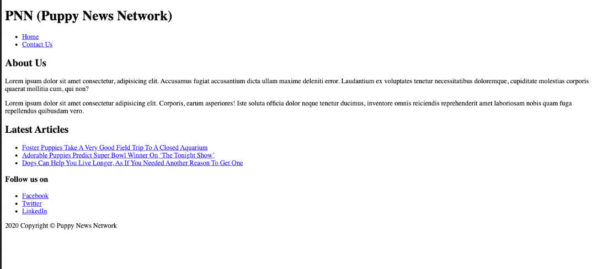

# Intro to HTML and CSS Tutorial

You recently landed an internship with a new startup called PNN, the Puppy News Network. So far, their writers have produced three articles, so it's time to launch a website. This is a new project that you'll create from scratch.

## Step One: Create the home page

Start by creating a new document, `index.html`, in the root of the project—that is, in the same directory as the `README.md` file:

```html
<!DOCTYPE html>
<html lang="en">
  <head>
    <meta charset="UTF-8">
    <meta name="viewport" content="width=device-width, initial-scale=1.0">
    <title>Document</title>
  </head>
  <body>

  </body>
</html>
```

> You can either copy and paste the code into the file, or you can use the Emmet shortcut that was mentioned in the Student Book: `! +tab`.

Next, you'll update the page title. This is the text that's displayed in the browser tab:

```html
<head>
  <meta charset="UTF-8">
  <meta name="viewport" content="width=device-width, initial-scale=1.0">
  <title>PNN (Puppy News Network)</title>
</head>
```

### Step Two: Create the header and about us page

The first thing your visitors should see is the name of your company. A good element to display this text in is a Heading 1, or `<h1>`:

```html
<h1>PNN (Puppy News Network)</h1>
```

Next, you need links at the top of your page so your visitors can navigate around the site. A good element to put navigation in is the `<nav>` element. The navigation is an unordered list, and each list item has a link to a page.

To start, you'll add navigation links for the home page, `index.html`, and a submission page, `submit.html`, which you haven't created yet.

Here's the code you need to create the navigation:

```html
<nav>
  <ul>
    <li><a href="index.html">Home</a></li>
    <li><a href="submit.html">Submit Article</a></li>
  </ul>
</nav>
```

While both the `h1` and `nav` element can stand alone, it seems like these can be grouped together using another element. Without looking at the code below, do you know what element you can use to group these together at the top of a document?

```html
<header>
  <h1>PNN (Puppy News Network)</h1>
  <nav>
    <ul>
      <li><a href="index.html">Home</a></li>
      <li><a href="submit.html">Submit Article</a></li>
    </ul>
  </nav>
</header>
```

After the header, you want to tell your visitors about the Puppy News Network. You can use the `<section>` element to signify that this is a stand-alone section. Typically, a section has a heading, but that isn't required. You already have a Heading 1, so the next heading is `<h2>`:

```html
<section>
  <h2>About Us</h2>

</section>
```

Below the "About Us" heading, still in the `section`, you'll add in two paragraphs of content. You can copy and paste this text into the file, if you want. There's also an Emmet shortcut you can use, too: with your cursor below the `<h2>`, type `p*2>lorem` and press `tab`. If it works, you have two paragraphs of Lorem ipsum text:

```html
<p>
  Lorem ipsum dolor sit amet consectetur, adipisicing elit. Accusamus fugiat
  accusantium dicta ullam maxime deleniti error. Laudantium ex voluptates
  tenetur necessitatibus doloremque, cupiditate molestias corporis quaerat
  mollitia cum, qui non?
</p>
<p>
  Lorem ipsum dolor sit amet consectetur adipisicing elit. Corporis, earum
  asperiores! Iste soluta officia dolor neque tenetur ducimus, inventore omnis
  reiciendis reprehenderit amet laboriosam nobis quam fuga repellendus quibusdam
  vero.
</p>
```

> What is Lorem ipsum? Lorem ipsum is placeholder text commonly used to demonstrate the visual form of a document or a typeface without relying on meaningful content.

### Step Three: Display the latest articles

Below the "About Us" section, you'll display the latest articles from the Puppy News Network. Currently, there are three articles that you need to display. Again, you'll start with a `<section>` and `<h2>`:

```html
<section>
  <h2>Latest Articles</h2>

</section>
```

Next, create a unordered list of links that the visitor can click on to view the articles. You'll find the news articles in the `news/` directory.

Before looking at the solution, use the information below to create the list of latest articles:

- Article 1
  - title: Foster Puppies Take A Very Good Field Trip To A Closed Aquarium
  - link: puppy-aquarium.html
- Article 2
  - title: Adorable Puppies Predict Super Bowl Winner On "The Tonight Show"
  - link: super-bowl.html
- Article 3
  - title: Dogs Can Help You Live Longer, As If You Needed Another Reason To Get One
  - link: live-longer.html

```html
<section>
  <h2>Latest Articles</h2>
  <ul>
    <li>
      <a href="news/puppy-aquarium.html">Foster Puppies Take A Very Good Field Trip To A Closed Aquarium</a>
    </li>
    <li>
      <a href="news/super-bowl.html">Adorable Puppies Predict Super Bowl Winner On "The Tonight Show"</a>
    </li>
    <li>
      <a href="news/live-longer.html">Dogs Can Help You Live Longer, As If You Needed Another Reason To Get One</a>
    </li>
  </ul>
</section>
```

### Step Four: Add main content and footer

The main content on your home page is "About Us" and the "Latest Articles" sections. There is a semantic HTML element that you can use to group these sections: the `<main>` element.

The HTML `<main>` element contains the primary content directly related to the `<body>` of a page. Add a start and end tag around the two sections:

```html
<main>
  <section>
    <h2>About Us</h2>
    <p>
      Lorem ipsum dolor sit amet consectetur, adipisicing elit. Accusamus fugiat
      accusantium dicta ullam maxime deleniti error. Laudantium ex voluptates
      tenetur necessitatibus doloremque, cupiditate molestias corporis quaerat
      mollitia cum, qui non?
    </p>
    <p>
      Lorem ipsum dolor sit amet consectetur adipisicing elit. Corporis, earum
      asperiores! Iste soluta officia dolor neque tenetur ducimus, inventore
      omnis reiciendis reprehenderit amet laboriosam nobis quam fuga repellendus
      quibusdam vero.
    </p>
  </section>
  <section>
    <h2>Latest Articles</h2>
    <ul>
      <li>
        <a href="news/puppy-aquarium.html">Foster Puppies Take A Very Good Field Trip To A Closed Aquarium</a>
      </li>
      <li>
        <a href="news/super-bowl.html">Adorable Puppies Predict Super Bowl Winner On ‘The Tonight Show’</a>
      </li>
      <li>
        <a href="news/live-longer.html">Dogs Can Help You Live Longer, As If You Needed Another Reason To Get One</a>
      </li>
    </ul>
  </section>
</main>
```

Lastly, you'll create a footer. The footer contain links to PNN's various social networks and a copyright notification. Add this code after the `<main>` section:

```html
<footer>
  <h3>Follow us on</h3>
  <ul>
    <li><a href="https://www.facebook.com">Facebook</a></li>
    <li><a href="https://www.twitter.com">Twitter</a></li>
    <li><a href="https://www.linkedin.com">LinkedIn</a></li>
  </ul>
  <p>2020 Copyright &copy; Puppy News Network</p>
</footer>
```

### Step Five: Run the home page with Live Server

If you followed the steps correctly, you'll have everything you need to launch your home page. In Visual Studio Code, right-click on `index.html` from the Explorer and choose `Open with Live Server`.




If you click on each article in the "Latest Articles" section, you'll notice that the first two look fine, but the third one needs some work.

## Step Six: Update the third news item

After further investigation, the third news item `live-longer.html` is unfinished. There are two issues that need to be addressed here:

1. The links in the header don't work.
2. The news article contains the raw content. You need to add the appropriate markup to the document.

> If you get stuck, look at the other completed articles.

## Step Seven: Create the submission page

At the top of each page is a link to submit an article. At the bottom of each news article is a section encouraging visitors to submit their articles.

Start by creating a new document, `submit.html`, and include the same header and footer that the home page has for consistency:

```html
<!DOCTYPE html>
<html lang="en">
  <head>
    <meta charset="UTF-8">
    <meta name="viewport" content="width=device-width, initial-scale=1.0">
    <title>PNN (Puppy News Network)</title>
  </head>
  <body>
    <header>
      <h1>PNN (Puppy News Network)</h1>
      <nav>
        <ul>
          <li><a href="index.html">Home</a></li>
          <li><a href="submit.html">Submit Article</a></li>
        </ul>
      </nav>
    </header>

    <footer>
      <h3>Follow us on</h3>
      <ul>
        <li><a href="https://www.facebook.com">Facebook</a></li>
        <li><a href="https://www.twitter.com">Twitter</a></li>
        <li><a href="https://www.linkedin.com">LinkedIn</a></li>
      </ul>
      <p>2020 Copyright © Puppy News Network</p>
    </footer>
  </body>
</html>
```

The main part of this page is the form to collect visitors' submissions. Start with the `<main>` element to give meaning to this section and present the user with a heading and text with information about this page:

```html
<main>
  <h1>Submit Article</h1>
  <p>Submit your puppy news using the form below</p>
  <!-- submission form -->
</main>
```

Next, create a form to collect information about the article. Each field that you need to collect information from the user must have a label and a form control.

You can use an empty div, `<div>&nbsp;</div>`, between each of the fields to create some space. Try and create the form on your own before looking at the solution:

- Form
  - action: `http://www.puppynewsnetwork.dev/api/articles`
  - method: `POST`
- Input
  - label: "Name:"
  - id: `name`
  - name: `name`
  - type: `text`
- Input
  - label: "Email Address:"
  - id: `email`
  - name: `email`
  - type: `email`
- Input
  - label: "Puppy News Title:"
  - id: `title`
  - name: `title`
  - type: `text`
- Textarea
  - label: "Puppy News Article:"
  - id: `body`
  - name: `body`
  - rows: `10`
  - cols: `60`

```html
<main>
  <h1>Submit Article</h1>
  <p>Submit your puppy news using the form below</p>
  <!-- submission form -->
  <form action="http://www.puppynewsnetwork.dev/api/articles" method="POST">
    <label for="name">Name:</label>
    <input type="text" id="name" name="name" />
    <div>&nbsp;</div>

    <label for="email">Email Address:</label>
    <input type="email" id="email" name="email" />
    <div>&nbsp;</div>

    <label for="title">Puppy News Title:</label>
    <input type="text" id="title" name="title" />
    <div>&nbsp;</div>

    <label for="body">Puppy News Article:</label>
    <div>&nbsp;</div>
    <textarea id="body" name="body" rows="10" cols="60"></textarea>
  </form>
</main>
```

> You'll learn some techniques throughout the week that make styling forms much easier.

## Step Eight: Add CSS

To put the finishing touches on the Puppy News Network, you'll add a few styles. Start by creating a new directory called `css` and a new file called `styles.css`.

In `styles.css`, create a type selector for the `body`:

```css
body {
}
```

In the body, you'll create two style declarations. The first updates the `font-family` to `Arial, Helvetica, sans-serif;`. The second updates the background color of the page to a subtle grey, `#f0f0f0;`:

```css
body {
  font-family: Arial, Helvetica, sans-serif;
  background-color: #f0f0f0;
}
```

Next, update the color of all the Heading 1 elements:

```css
h1 {
  color: steelblue;
}
```

Finally, you need to add the style sheet to each of your documents. The path to the style sheet is relative to the document. If you're adding a link to the style sheet in `index.html` or `submit.html`, the link looks like this:

```html
<link rel="stylesheet" href="css/styles.css" />
```

It must go below the title in the `<head>` section:

```html
<head></head>
  <meta charset="UTF-8">
  <meta name="viewport" content="width=device-width, initial-scale=1.0">
  <title>PNN (Puppy News Network)</title>
  <link rel="stylesheet" href="css/styles.css" />
</head>
```

When you add the style sheet to each of the three news articles, the path will be different. To get to the css directory, you need to move back one directory (`../`) and then go into the `css/` directory. The path looks like this:

```html
<link rel="stylesheet" href="../css/styles.css" />
```

If you followed the steps correctly, this is the final product:


## Summary

In this tutorial, you learned how to create a new home page that informs visitors about the company and displays the company's recent articles. You also gave visitors a way to submit articles.

It might not be the best-looking website, but the structure is solid. Just like building a house, you need to start with a strong foundation and the cosmetic additions can be added later.


--------------------------------------------------------------------------------------------------------------------------------------------------------------------------------------------


# CSS Selectors Tutorial Final

In this tutorial, you'll build a news application that displays a list of headlines with related articles.

## Starting code

The starting code contains all the HTML for the new application in `index.html`. The style sheet includes several styles to get you started. You need to fill in the rest.

If you run `index.html` using Live Server in VS Code, you'll see this:


In this tutorial, you'll fill the CSS in the `styles.css` file to create the following layout:


## Step One: Modify page layout

### Position left panel

First, you'll need to position the menu on the left and the main content. You'll need to set properties on the `<section>` that contains the menu and then on the `<main>` element that contains the content. The menu is to be placed right up against the left side and very top of the display and to be `300px` wide.

There are two CSS selectors involved with this change. The first CSS selector for the `<section>` points to the section with the `id` attribute of `left-panel`. It looks like this:

```css
#left-panel
```

To position the menu, you'll need to set the `position` and `left` and `top` properties.

Add this code to the CSS file:

```css
#left-panel {
  position: absolute;
  left: 0;
  top: 0;
  width: 300px;
}
```

### Position main content

The CSS selector for the `<main>` element points to the main element that is a direct descendant of the `<body>` element. It looks like this:

```css
body > main
```

To position the main content, you'll need to set the `position` and `left` properties.

Add this code to the CSS file:
```css
body > main {
  position: absolute;
  left: 300px;
}
```

> Why use a descendant selector here? There may be multiple elements of the same type within an HTML document. Using a descendant selector ensures that your styles are applied to the specific element you want to style.

At this point, your solution looks like this:


## Step Two: Format the articles

To format the articles, you'll need to:

- Style the article elements
- Position the article image
- Format the list of related news items
- Format the citation
- Format the links

### Style the articles

The article requires a `1px`, `solid` border with a radius of `8px` using the `border-color` of `silver`. When you define a border, you'll notice that the text has no spacing. You can add spacing to the *inside* of the `<article>` using `padding` that's set to `10px`.

Next, add spacing between the articles since they're too close. You'll add spacing to the *outside* top and bottom of the article. To do so, add a `margin` of `15px` for the top and bottom margins and `0` for the left and right margins. The articles are descendants of the `<main>` element, so use the descendant selector, as shown below:

```css
body > main > article {
  border: 1px solid silver;
  border-radius: 8px;
  padding: 10px;
  margin: 15px 0;
}
```
> Try adding the above styles one at a time to see how each one impacts the page. After each change, save the `styles.css` file, and view the page in your browser. You may need to refresh the page.

### Position the article image

The image placement in the final solution requires the image to be on the right side of the block containing the article. You can use the `float` property and assign the value of `right`. Add this CSS to the file:

>Note the use of the descendant selector below.

```css
main > article > img {
  float: right;
  border-radius: 15px;
}
```

### Format related new articles list

The list of related news articles is ready for styling. The solution shows that you need to bring the headings and citations closer together.

You'll reduce the margin surrounding the article and related article titles. These are contained in `<h3>` and `<h4>` elements, which have default margins. Set the `margin` to `3px` by adding this CSS:

```css
body > main > article h3,
body > main > article h4 {
  margin: 3px;
}
```

Next, you'll need to set `margin-bottom` to `15px` for the `<li>`s to create some space between the list items. Add the following CSS:

```css
body > main > article > ul > li {
  margin-bottom: 15px;
}
```

### Format the citation

Next, change the `font-size` and font `color` to match the requirements. The citations are in `<span>` elements that have a `class` attribute with the class name of `citation`. Select the `<span>` in the `<article>` with that class name. Add this CSS:

```css
body > main > article span.citation {
  font-size: .7em;
  color: darkgray;
}
```

### Format the "View Full Coverage" links

The next step is to format the "View Full Coverage" link (`<a>` tag) to remove the underline and reduce the `font-size`. In this case, the `<a>` tags have an attribute of `target` with a value of `_blank`—this attribute and value makes links open in a new window or tab. Use an attribute selector to select all the `<a>`s with that attribute and value to apply these CSS values. Add this CSS:

```css
a[target=_blank] {
  text-decoration: none;
  font-size: .7em;
}
```

Lastly, add a `:hover` *pseudo-class* to the `<a>`s using the same selector. The intent is to underline the link text when the mouse rolls over the link:

```css
a[target=_blank]:hover {
  text-decoration: underline;
}
```

When you've completed all of the items related to the article, your HTML page looks like this:


## Step Three: Format the left menu

The menu is contained in the `<section>` element that is right under the `<body>` tag. The structure looks like this:

```html
  <section id="left-panel">
    <nav>
      <menu>
        <li>
          <a href="#">Business</a>
        </li>
        <li>
          <a href="#">Technology</a>
        </li>
        <li>
          <a href="#">Entertainment</a>
        </li>
        <li>
          <a href="#">Sports</a>
        </li>
        <li>
          <a href="#">Health</a>
        </li>
      </menu>
    </nav>
    <hr>
  </section>
```

### Format the menu list items

Your first tasks for formatting the menu are to:

- Remove the "dots" in front of the list items
- Create some spacing around the menu items

You already used the `id` selector for the `<section>` containing the menu. Now, you'll work with the `<li>`. Set the `list-style` to `none`, and `padding` to `13px 0`. Add this CSS:

```css
#left-panel > nav > menu > li {
  list-style: none;
  padding: 13px 0;
}
```

### Format the links

Next, you need to format each of the links:

- Remove the underline from the `<a>`s
- Change the `font-size` and font `color`
- Change the `<a>` from an *inline* element to an *block* level element
- Set the width to `70%` and center the `<a>` within the menu

First, add a CSS selector that selects the `<a>` tags that exist within the `<menu>`'s `<li>`s. Add styles to the selector that provide each of the effects in the list of styles needed to accomplish the goal:

```css
#left-panel > nav > menu > li > a {

}
```

You can remove the underline from the anchor tags by setting the `text-decoration` to `none`:

```css
#left-panel > nav > menu > li > a {
  text-decoration: none;
}
```

Next, change the font size and color:

```css
#left-panel > nav > menu > li > a {
  text-decoration: none;
  font-size: 1.2rem;
  color: black;
}
```

Set the width to `70%` and center the `<a>` within the menu using `margin`:

```css
#left-panel > nav > menu > li > a {
  text-decoration: none;
  font-size: 1.2rem;
  color: black;
  width: 70%;
  margin: 15px auto;
}
```

>Using a margin of `15px auto` is one method of "centering" content within a block-level element. So, this centers the `<a>`s in the `left-panel`. This only works on block-level elements, so this is set to `block`.

This is the final CSS to add for this step:

```css
#left-panel > nav > menu > li > a {
  text-decoration: none;
  font-size: 1.2rem;
  color: black;
  width: 70%;
  margin: 15px auto;
  display: block;
}
```


## Step Four: Add menu highlight and rollover effect

Now that your left menu is styled, you'll add some other features to it.

### Add menu highlight

If you look at the markup for this tutorial, you'll notice that the Business list item has a class of `active-left-menu`:

```html
<li class="active-left-menu">
  <a href="#">Business</a>
</li>
```

Create the CSS rules for the `active-left-menu` to add the blue background and curved border:

```css
.active-left-menu {

}
```

You'll set the `background-color` using the CSS function `rgba()`. This function is similar to using a hexadecimal code—like `#87CEFA`—but instead uses integers between 0 and 255 for the values of Red, Green, and Blue. The fourth parameter for the function is for the "Alpha Channel", which is a graphics term for opacity or transparency. This value is a decimal number between 0 and 1, where 0 is fully transparent and 1 is fully opaque. With some transparency, you can let some of the color behind the element come through for a different effect than if the color was solid.

You'll see this, hexadecimal codes, and another function called `rgb()`, which doesn't accept a transparency value, throughout your career.

Pass these four arguments to the function to give you a light blue color with half transparency:

```css
.active-left-menu {
  background-color: rgba(135, 206, 250, 0.5);
}
```

To create the curved border, use the `border-radius` property. It takes a separate measure of a radius to apply to each corner starting from the top left corner and then moving clockwise. Since the border is only curved on the top right and bottom right, you need to set values for those and zeros for the others:

```css
.active-left-menu {
  background-color: rgba(135, 206, 250, 0.5);
  border-radius: 0 30px 30px 0;
}
```

Next, update the font `color` to `blue` for the active menu item:

```css
#left-panel > nav > menu > li.active-left-menu > a {
  color: blue;
}
```

>Why is this selector different? You must use the same *specificity* with the selector used so far, or the more specific styles override them. The original font `color` for these `<a>` tags was set using the same selector you see here. To see what happens otherwise, change the selector to `.active-left-menu > a`. You'll see that the font `color` remains black.

### Add menu rollover effect

You'll want to provide some feedback when an available menu item can be clicked on. To do this, you'll use the `:hover` pseudo-class.

Apply the `:hover` pseudo-class to the `<li>`s within the menu that apply the `background-color` of `rgba(208, 235, 252, 0.5);`. The border must match the active menu items' border and its `border-radius` property. The font `color` must be set to `blue`. Add this CSS:

```css
#left-panel > nav > menu > li:hover {
  background-color: rgba(208, 235, 252, 0.5);
  border-radius: 0 30px 30px 0;
  color: blue;
}
```
With these styles applied, you'll see a light blue background with a curved border appear for each menu element in the left panel as you roll your mouse over the item.

If you have done everything correctly, your page looks like this:


## Summary

You've accomplished a lot here. You created a two-panel layout by arranging a menu of items on the left and main content on the right. You used several different types of CSS selectors and many CSS styles to accomplish this goal. The website looks much better and now provides feedback with hover effects.


---------------------------------------------------------------------------------------------------------------------------------------------------------------------------------------------------


# CSS Grid Tutorial

In this tutorial, you'll apply CSS Grid Layout and *Responsive Design* to a news application.

## Starting code

Look at the starting HTML code for the application in `index.html`. The HTML contains a left panel, main content area, and right panel. The stylesheet in `styles.css` includes styles for the general styling of the application. You'll work with both files in this tutorial.

If you run `index.html` using Live Server in VS Code, you'll see this:


Notice that the left panel is at the top, the main content is below that, and the right panel (yellow background) is below that. You'll rearrange this layout.

## Step One: Apply a grid to the page layout

In this step, you'll lay out the three areas—the left panel, main content, and right panel—of the document along the lines of a grid.

### Add grid layout styles

First, make the body a grid container. Apply a new CSS rule to the `body` that sets the `display` property to `grid`. The CSS looks like this now:

```css
body {
  margin: 0;
  padding: 0;
  display: grid;
}
```

As you can see, this style alone doesn't fix the layout. This is because you haven't defined the columns and rows. To do this, you'll need to add rules for `grid-template-columns`.

The design has a left panel, main content area, and a right panel. This means the layout has three columns. The left panel must be `300px` wide, and the right column must be `250px` wide. The main content area must take up the remaining space. Use one *fractional unit* to achieve this goal. The CSS property value for one fractional unit is `1fr`.

To define the columns, add the `grid-template-columns` property to the `body`. You'll assign three values to the property:

1. The width of the left panel: `300px`
2. The width of the main content area: `1fr`
3. The width of the right panel: `250px`

The `body` styles now look like this:

```css
body {
  margin: 0;
  padding: 0;
  display: grid;
  grid-template-columns: 300px 1fr 250px;
}
```

Add some spacing between the grid items using the CSS `gap` property and assign it a value of `15px`. The CSS now looks like this:

```css
body {
  margin: 0;
  padding: 0;
  display: grid;
  grid-template-columns: 300px 1fr 250px;
  gap: 15px;
}
```
Now the layout is finished.

> What value do these changes provide? You're already well on your way to a responsive design. You'll see this in the next section.

## Step Two: Apply a responsive design to the page layout

With the application running in the browser, expand the browser window until it takes up the entire screen. Next, grab the right edge of the browser. Slowly drag the edge of the browser window to make it smaller and smaller. Notice that the text wraps according to the *Normal Flow* rules. When the window is as small as it can be, it looks like this:


The menu now takes up too much space in the viewport. The article titles appear to be "squished", and you can't see the right panel.

After completing this tutorial, the fullscreen final solution looks like the image above. On a smaller screen, the page looks like this:


Notice that the menu is now across the top with the main content below and the right panel below that (not shown).

### Review layout goals

**For screen sizes <= 800px:**

1. The left menu is placed at the top of the screen and spread across the width of the screen rather than down the left side.
2. The main content area takes up the entire width of the screen with spacing from the edges of the screen.
3. The right panel falls below the main content and takes up the full width of the screen with spacing.

### Add responsive styles

Add this special CSS declaration at the bottom of the `styles.css` file:

```css
@media screen and (max-width: 800px) {
}
```
This means "_apply the styles contained within to media type screen and with a maximum width of `800px`._"

From this point forward, all styles go into the media query block.

Within the media query, you'll take advantage of CSS cascading by overriding only those styles needed to achieve the layout goals. Don't duplicate any styles that are already set and don't need to be changed. For example, the `body` element already has the `display` property set to `grid`. There's no reason to state this again. The only thing to do here is change, or override, the grid layout.

The layout goals section states that three columns need to become three rows. To accomplish this, override the `body`'s `grid-template-column` property to be a single value of `100%`. The original `grid-template-column` had three values that represented the sizes of three columns.

Using a single setting here only provides a single column that's `100%`, or "the entire" screen width. Additionally, each item must be offset from the edges. You'll add a new property called `justify-items` to the `body` and set its value to `center`. Add this CSS to the media query:

```css
    body {
        grid-template-columns: 100%;
        justify-items: center;
```

The `@media` styles looks like this:

```css
@media screen and (max-width: 800px) {
    body {
        grid-template-columns: 100%;
        justify-items: center;
    }
}
```

Make sure the browser window is less than `800px` wide. Now when you scroll down the page, you'll see the menu followed by the main content area, and then the right column content, all thanks to these two CSS styles.

Now fix the spacing around the menu items so they don't take up as much screen space on a mobile device. Set the `margin` to `5px auto` on the `#left-panel > nav > menu`. Then set the `padding` to `0 7px` on the `#left-panel > nav > menu > li`. Finally, set the `margin` to `0` on the `#left-panel > nav > menu > li > a`. Once you add this CSS to the Media Query, it looks like this:

```css
    #left-panel > nav > menu {
        margin: 5px auto;
    }

    #left-panel > nav > menu > li {
        padding: 0 7px;
    }

    #left-panel > nav > menu > li > a {
        margin: 0;
    }
```

Next, you'll fix the light blue background. Right now, it's rounded on one end but not the other. To fix this, set the `border-radius` property on both the `.active-left-menu` and `#left-panel > nav > menu > li:hover`. Add these styles below the others. The CSS looks like this:

```css
    .active-left-menu,
    #left-panel > nav > menu > li:hover
     {
        border-radius: 30px;
    }
```

Now you'll change the menu list from a vertically stacked list to a horizontal list. Add a `display` property to the `#left-panel > nav > menu > li` and set the value to `inline-block`. As you'll recall, this makes the elements `inline` so *normal flow* is in effect while at the same time allowing the elements to receive dimensions. The CSS now looks like this:

```css
    #left-panel > nav > menu > li {
        padding: 0 7px;
        display: inline-block;
    }
```

The solution is progressing nicely.

Notice the heading _Headlines_ isn't centered, and that there's too much space between the heading and the menu. This is an element within one of the _Grid Items_ and not a grid item itself. That means the `justify-items` that is applied to the grid doesn't apply.

To fix this, add a style, `text-align`, to the `main h3` element and set its value to `center`. To fix the spacing, set the `margin` to `0`. The CSS for this looks like:


```css
    main h3 {
        text-align: center;
        margin: 0;
    }
```

The final responsive portion of the file should look like this:

```css
@media screen and (max-width: 800px) {
    body {
        grid-template-columns: 100%;
        justify-items: center;
    }
    #left-panel > nav > menu {
        margin: 5px auto;
    }

    #left-panel > nav > menu > li {
        display: inline-block;
        padding: 0 7px;
    }

    #left-panel > nav > menu > li > a {
        margin: 0;
    }

    .active-left-menu,
    #left-panel > nav > menu > li:hover {
        border-radius: 30px;
    }

    main h3 {
        text-align: center;
        margin: 0;
    }

}
```
If you've done everything correctly, the page looks like this:


When you resize the window, you may find that setting the _breakpoint_ to `800px` allows the main content to "squish" up and become unsightly. Experiment with different _breakpoints_ to discover a better solution. Share what you find with the class.

Additionally, you may find that a single breakpoint is rarely adequate to support the variety of screen sizes applications appear within. You might consider adding other media queries with different breakpoint sizes and styles that improve the view for those screen sizes.

## Summary

In this tutorial, you learned how to transform a non-responsive application into one that accommodates different screen sizes and use a CSS Grid and CSS Media Queries to establish breakpoints. The result represents a news article listing that can be viewed on multiple devices.


----------------------------------------------------------------------------------------------------------------------------------------------------------------------------------------------------


# CSS flexbox tutorial

In this tutorial, you’ll continue working on the same news application from the previous unit, now adding a header and a weather component to it as CSS flexboxes. The existing HTML still uses CSS grid, and you'll add these new components to the grid. CSS grid and flexbox can exist in the same layout and complement each other.

The final product of your changes looks like this:


The new components are also responsive for tablet and phone layouts:

**Header Tablet**:


**Weather Tablet**:

![Weather Tablet][def]

**Header Phone**:


**Weather Phone**:


Notice how the weather component goes from column, to row, and back to column as the viewport width changes.

## Before you begin

Look at the starting HTML code for the application in `index.html`. The HTML is the same as that of the solution from the previous unit, except:

- A `<div>` with the class `container` is now the CSS grid container.
- The CSS grid has declared `grid-template-areas` and `grid-template-rows`.

The style sheet in `styles.css` includes the styles for the general styling of the application. Some style rules for the new components are also included. Today, you'll add the flexbox styling.

Before you begin, run `index.html` using live server. Notice that application looks like the one you created yesterday:


## Step One: Add header to page grid

In this step, you’ll add the `<header>` element to the page and the existing grid.

In `index.html`, add the following HTML after the `<div class="container">` line so that `<header>` is a child element of the `div`:

```HTML
<header id="page-header">
  
  <input type="search" placeholder="Search..." id="search" />
  <nav>
    <ul>
      <li><a href="#">Our Mission</a></li>
      <li><a href="#">Our Team</a></li>
      <li><a href="#">Login</a></li>
    </ul>
  </nav>
</header>
```

If you reload the page now, you might not see the `header`, or another element might overlap it. You have to add CSS so it's displayed in the grid.

In `styles.css`, locate the `#page-header` selector near the top of the file. Add `grid-area: header;` to the CSS rule for the page header:

```CSS
#page-header {
  box-shadow: 0 4px 5px 0 rgba(0,0,0,0.14), 0 1px 10px 0 rgba(0,0,0,0.12), 0 2px 4px -1px rgba(0,0,0,0.2);
  padding-left: 10px;
  padding-right: 10px;
  grid-area: header;
}
```

Next, locate the `div.container` selector a few lines down, and add `"header header header"` as the first line for the `grid-template-areas` declaration:

```CSS
div.container {
  display: grid;
  grid-template-columns: 300px 1fr 250px;
  grid-template-rows: 100px 1fr 1fr;
  gap: 15px;
  grid-template-areas:
    "header header header"
    "left-panel main special-announcements"
    "left-panel main .";
}
```

The header is now in the correct location on the page, but the layout needs work:


You'll adjust the header's layout using flexbox.

## Step Two: Add flexbox to the header

In this step, you'll add flexbox styling to `#page-header`.

Add a declaration to set the `display` property to `flex`:

```CSS
#page-header {
  box-shadow: 0 4px 5px 0 rgba(0,0,0,0.14), 0 1px 10px 0 rgba(0,0,0,0.12), 0 2px 4px -1px rgba(0,0,0,0.2);
  padding-left: 10px;
  padding-right: 10px;
  grid-area: header;
  display: flex;
}
```

The header nearly resembles the final product, but the elements are too close together on the left:


Add another rule to set the `justify-content` property to `space-between`. The `justify-content` property defines the alignment of the flex items along the row or column that the flexbox defines. The `space-between` value evenly distributes the items along that row or column, with the first one at the beginning of the line and the last one at the end of the line.

Your header looks like this:


You've aligned the elements in the header horizontally. Now you need to align the elements vertically. Add a rule for the `align-items` property and set to `center`. The `align-items` property is like the `justify-content` property, but it works in the perpendicular direction.

Your header now looks like this:


However, if you resize the viewport to a tablet width like 768px, the logo and links are close to the sides and that's not usually touch-friendly.

## Step Three: Add responsiveness to header

In `styles.css`, there are two media queries: one for tablet widths (`max-width: 800px`) and one for phone widths (`max-width: 536px`).

Find the `#page-header` selector in the tablet media query. Add `justify-content` and set it to `space-evenly`. The `space-evenly` value is like the `space-between` value you set earlier, but it adds spacing before the first and after the last items.

The tablet layout looks better, but the nav wraps onto two lines on phone layouts. The nav must be on its own line.

Find the `#page-header` selector in the phone media query. Add `flex-wrap` and set it to `wrap`. By default, flex items try to fit onto one line, but you can allow them to wrap onto another line with `flex-wrap: wrap;`.

Your header now looks like the screenshots shown earlier at all sizes.

## Step Four: Add weather component to page grid

In this step, you’ll add the weather component to the page and the existing grid.

Add the following HTML to `index.html` near the end between the closing `</aside>` and the closing `</div>` lines:

```HTML
<aside id="weather">
  <article>
    <header>Weather</header>
    <section>
      <p>
        <span class="day">Today:</span>
        <span class="forecast">Sunny ☀️</span>
        <span class="temperature">High: 67 | Low: 56</span>
      </p>
      <p>
        <span class="day">Tomorrow:</span>
        <span class="forecast">Cloudy ⛅</span>
        <span class="temperature">High: 54 | Low: 49</span>
      </p>
      <p>
        <span class="day">Saturday:</span>
        <span class="forecast">Sunny ☀️</span>
        <span class="temperature">High: 78 | Low: 62</span>
      </p>
      <p>
        <span class="day">Sunday:</span>
        <span class="forecast">Sunny ☀️</span>
        <span class="temperature">High: 73 | Low: 58</span>
      </p>
      <p>
        <span class="day">Monday:</span>
        <span class="forecast">Thunderstorms ⛈️</span>
        <span class="temperature">High: 56 | Low: 49</span>
      </p>
    </section>
  </article>
</aside>
```

If you reload the page now, you might not see the weather component where you'd expect it to be. Like the `<header>` in step one, you have to add CSS so it's displayed in the grid.

In `styles.css`, locate the `div.container` selector again. Before it, add a selector for `aside#weather` and assign a `grid-area` name:

```CSS
aside#weather {
  grid-area: weather;
}
```

In the `div.container` rules, replace the `.` in the `grid-template-areas` with the name assigned to the weather component:

```CSS
div.container {
  display: grid;
  grid-template-columns: 300px 1fr 250px;
  grid-template-rows: 100px 1fr 1fr;
  gap: 15px;
  grid-template-areas:
    "header header header"
    "left-panel main special-announcements"
    "left-panel main weather";
}
```

The weather component is now displayed where and how you'd expect on the desktop layout. However, if you change the viewport to a tablet width, like 768px, you'll see it's still displayed in a column and not a row like it should be.

## Step Five: Add flexbox styling and responsiveness to weather component

In this step, you'll add flexbox styling to the weather component and make it responsive.

Since the weather component displays correctly on the desktop layout, you only need to add the flexbox styling in the media queries.

In the tablet layout, add a selector for `aside#weather section`. Set the `display` property to `flex`. Since the default value of `justify-content` sets all flex items aligned to the left, you'll want to set this property too. Play around with the different `space-*` values and see which one looks best to you:

```CSS
aside#weather section {
  display: flex;
  justify-content: space-around;
}
```

> Note: If you look at the HTML that you added for the weather, the `<section>` element contains the `<p>` elements that make up each day's forecast. When you set an element to `flex`, it only makes the direct children flex items. In this case, the flex items are the `<p>` elements, and that's why you have to set the selector to the `section` in `aside#weather`. Otherwise, `<article>` becomes the flex item.

Finally, if you shrink the viewport down to phone layout, you'll notice the row layout for the weather stops being useful. You can change the direction you want flexboxes to go. By default, they're displayed as a row, but you can change it to a column.

In the tablet layout, add a selector for `aside#weather section`. Set the `flex-direction` property to `column`.

```CSS
aside#weather section {
  flex-direction: column;
}
```

## Summary

In this tutorial, you learned how to add CSS flexboxes to an existing application, how to change a box's direction and spacing, and how to incorporate them with CSS grids. The result represents a more fluid layout that works across many screen widths.


--------------------------------------------------------------------------------------------------------------------------------------------------------------------------------------------------------


# Intro to JavaScript tutorial

In this tutorial, you'll run unit tests on a collection of JavaScript functions. At first, all the tests are failing. You'll make changes in each step so that by the end, all the tests are passing.

## Step One: Start the tests

To get started, open this tutorial folder in Visual Studio Code.

In addition to this README, there are three other files:
* `tests.html` - an HTML file for displaying test results
* `tests.js` - a JavaScript file containing tests for `tutorial.js`
* `tutorial.js` - the JavaScript file you'll modify

Right-click `tests.html` and select "Open with Live Server." In your browser, you'll see a list of failing tests. Leave that browser window open as you work through the rest of the steps in the tutorial.

## Step Two: Reassign a variable

In Visual Studio Code, open `tutorial.js`, and look at the first function:

```javascript
function stepTwo() {
  const result = false;
  result = true;
  return result;
}
```

This function declares a variable named `result` using the keyword `const`, and assigns it the value `false`. When you use `const` to declare a variable, that variable can't be reassigned. Since the next line attempts to assign the value `true` to `result`, an error occurs and the test fails. To make the test pass, replace `const` with `let`:

```javascript
function stepTwo() {
  let result = false;
  result = true;
  return result;
}
```

When you declare a variable with `let`, that variable can be reassigned. After you change the `const` to `let` and save the file, you'll see the "Step two" test pass.

It's a good habit to declare variables with `const` by default. If you later find that the variable needs to change, you replace the `const` with a `let` like you did here.

## Step Three: Add values to an array

The next function creates an empty array and assigns it to a variable named `values`:

```javascript
function stepThree() {
  const values = [];
  return values;
}
```

The test for step three is failing because it expects the array to contain a boolean, a number, and a string. JavaScript is a loosely typed language.

If you look at the `stepTwo()` function again, you'll see that the `result` variable wasn't declared a boolean. JavaScript variables can refer to data of any type. Similarly, JavaScript arrays can include a variety of data types.

To add items to an array, use the `push` method of the array. Add a boolean, number, and string to the array:

```javascript
function stepThree() {
  const values = [];
  values.push(false);
  values.push(99.99);
  values.push('example');
  return values;
}
```

Now the test passes. Notice that `values` being declared with `const` didn't prevent you from adding items to the array. All that `const` prevents is reassignment, so you can still make changes to the array `values` refers to, but you can't assign a different array to `values`.

## Step Four: Round a number to two decimal places

The next function assigns the result of dividing 2 by 3 (0.6666666666666666) to a variable named `twoThirds`, and then assigns that value to a variable named `roundedTwoThirds`:

```javascript
function stepFour() {
  const twoThirds = 2 / 3;
  const roundedTwoThirds = twoThirds;
  return roundedTwoThirds;
}
```

The test for step four is failing because it expects `roundedTwoThirds` to be rounded to two decimal places. You can round a number to any number of decimal places using its `toFixed` method:

```javascript
function stepFour() {
  const twoThirds = 2 / 3;
  const roundedTwoThirds = twoThirds.toFixed(2);
  return roundedTwoThirds;
}
```

Notice, though, that after you make this change the test still doesn't pass. The message from the failing test says, "expected '0.67' to equal 0.67" (the quotes around '0.67' indicate it's a string). That's because the `toFixed` method returns a string rather than a number. To convert that string to a number, use the `Number.parseFloat` method:

```javascript
function stepFour() {
  const twoThirds = 2 / 3;
  const roundedTwoThirds = Number.parseFloat(twoThirds.toFixed(2));
  return roundedTwoThirds;
}
```

Now the test passes.

## Step Five: Check for strict equality

In the previous step, the string '0.67' didn't match the number 0.67 because they weren't *strictly* equal. Strict equality means the data type and value must be the same. The regular equality operator (`==`) in JavaScript doesn't require the data types to match, as the next function shows:

```javascript
function stepFive() {
  let answer;
  if (100 == '100') {
    answer = 'Yes';
  } else {
    answer = 'No';
  }
  return answer;
}
```

The test is failing because the value of `answer` being returned is 'Yes'. That's because the number 100 and the string '100' can be converted to equal values, which is what `==` checks for. Since this is often a source of bugs, it's preferable to use the strict equality operator `===` unless you have a good reason not to. Change the `==` to `===`, and the test passes.

## Step Six: Iterate through an array

The next function includes an array of numbers named `amounts` and a variable named `sum`:

```javascript
function stepSix() {
  const amounts = [10, 20, 30, 40];
  let sum = 0;

  return sum;
}
```

The test is failing because it expects `sum` to be the sum of the values in `amounts`. One way to add those up is with a `for` loop. You could add a `for` loop like this:

```javascript
function stepSix() {
  const amounts = [10, 20, 30, 40];
  let sum = 0;
  for (let i = 0; i < amounts.length; i++) {
    sum += amounts[i];
  }
  return sum;
}
```

That gets the test to pass, but there's no need for the value `i` here, so it's preferable to use a `for..of` loop:

```javascript
function stepSix() {
  const amounts = [10, 20, 30, 40];
  let sum = 0;
  for (const amount of amounts) {
    sum += amount;
  }
  return sum;
}
```

Notice that in the `for` loop, you declare `i` using `let` because after it's declared at the beginning of the loop, its value is reassigned for each iteration. 

In the `for..of` loop, you use `const` because the `amount` variable is re-declared for each iteration, and there's no reassignment.

## Step Seven: Add a property to an object

The last function creates an object to represent an ice cream cone:

```javascript
function stepSeven() {
  const iceCreamCone = {
    flavor: 'strawberry',
    coneType: 'waffle'
  }

  return iceCreamCone;
}
```

In JavaScript, you can create an object by enclosing a list of key-value pairs in curly brackets. The keys are the properties of the object. So in this example, the object `iceCreamCone` refers to has the properties `flavor` and `coneType`.

One reason the test is currently failing is because it's looking for a property named `numberOfScoops` with the value 2. Add that property to the object:

```javascript
function stepSeven() {
  const iceCreamCone = {
    flavor: 'strawberry',
    coneType: 'waffle',
    numberOfScoops: 2
  }

  return iceCreamCone;
}
```

To get the final test passing, you also need to add a `hasSprinkles` property with the value `true`. You can add properties to an object in JavaScript after it's created. 

To do that, you assign a value to the property. Add the `hasSprinkles` property to `iceCreamCone`:

```javascript
function stepSeven() {
  const iceCreamCone = {
    flavor: 'strawberry',
    coneType: 'waffle',
    numberOfScoops: 2
  }

  iceCreamCone.hasSprinkles = true;
  return iceCreamCone;
}
```

And now, all the tests pass.

## Next steps

Experimenting with the basics of JavaScript can be complicated because of the configuration needed to get JavaScript running in your browser. A more direct method for trying out JavaScript is using the JavaScript console in your browser. 

Open the developer tools (by pressing F12) and in the "Console" tab, type a JavaScript expression to have it immediately evaluated. Try declaring some variables, creating arrays and objects, and using the various methods described in the reading for manipulating strings and arrays.


--------------------------------------------------------------------------------------------------------------------------------------------------------------------------------------------------------


# Tutorial for JavaScript Functions

In this tutorial, you'll practice writing some JavaScript functions. These are a lot like the methods you wrote in C# or Java, but they're different in some very subtle ways. You'll also practice documenting your functions so other developers know what's going on and how to use them.

You can run the Live Server on VS Code on either the `ui.html` file or the `test.html` file, whichever you prefer. The `ui.html` file looks blank, but it'll fill in with values when you start writing your functions. The `test.html` file shows a series of unit tests that pass as you complete the tutorial.

Then open `tutorial.js` in VS Code. You'll see several comments and half-finished functions in here. You'll fill those in now.

## `turnOn()`

The first comment at the top asks you to write a function called `turnOn` that returns `true`. You first need to write the function signature in JavaScript:

``` javascript
function turnOn() {

}
```

You then need to return the value `true`.

```javascript
function turnOn() {
  return true;
}
```

When you save that, the unit test for that function should now pass and the UI appears. If that didn't work, make sure you spelled everything correctly and make sure your function is after the `*/` of the comments and not before it.

Remember that you can't specify the return type of a function in JavaScript. The only way a programmer knows the return type is by reading the code or reading the JSDoc comments before the code.

## `returnsName()`

The next function is another simple function that returns your name. Try to fill this out yourself without copying from the example below.

This is a function that takes no arguments and returns a string that contains your name. The finished function would look something like this:

```javascript
function returnsName() {
  return "Jane Doe";
}
```

## `returnGivenParameter()`

Functions in JavaScript can also take parameters, just like methods in C# and Java. Write a function that takes a single parameter and then return it. Try to fill this out yourself without copying from the example below.

Again, in JavaScript, you can't specify types for the parameters, so the function signature won't include types, just the name of the parameter. In this case, the parameter is called `thing`, but you can call it anything you want.

```javascript
function returnGivenParameter(thing) {
  return thing;
}
```

## `takeOptionalParameter()`

Functions in JavaScript can't be overloaded as in C# or Java. In those languages, if you want different parameters for the same method, you can create a different method with the same name with those different parameters.

In JavaScript, if you define a function with the same function as another, the first is overwritten by the second and ceases to exist. So to have a function be able to take different numbers of parameters, you can give parameters a default value. If you don't give a default value for a parameter and that parameter is not given, the value is `undefined`. An `undefined` value might not be what you want and might break your function but with a default value, you get to define what a missing parameter means.

Now you'll create a function that takes a single parameter and returns it. However, this time, if you don't get a parameter, you want to return `0`, and you want to do it without using an if statement.

The solution to this looks something this:

```javascript
function takeOptionalParameter(thing = 0) {
  return thing;
}
```

## `filterArrayToOnlySingleDigitNumbers()`

Now you're going to look at writing a function that you can pass to another function. This is a common activity in JavaScript, and you'll use a built-in JavaScript function to perform this task: the Array `filter()` function.

When creating functions to pass to other functions, they are typically written as anonymous functions using the "fat arrow" or "rocket" syntax.

The main part of the function has already been written for you. You need need to fill in the anonymous function.

``` javascript
function filterArrayToOnlySingleDigitNumbers(arrayToFilter) {
  return arrayToFilter.filter(
    // Your code goes here
  );
}
```

Remember that filter works by taking a function, running that function on every element in the array, and returning in a new array every element that returned `true`. So what you need to write is a function that returns `true` if the element is only a single digit.

So the anonymous function needs to take one parameter—the element from the array—and return true if the element is a single digit. That could look something like this:

``` javascript
(element) => {
  return element < 10;
}
```

Take the element, check to make sure it's less than ten, and then return the result of that check (either `true` or `false`).

In the tests, you can see that there is a part of this that is failing. Can you fix this function to make that pass as well? Try to fill this out yourself without copying from the example below.

If the numbers are negative, the anonymous function doesn't properly filter out double-digit negative numbers. You can fix that by changing the anonymous function to this:

``` javascript
(element) => {
  return element < 10 && element > -10;
}
```

## `mapArrayToDoubleAllNumbers()`

There is also an array function called `map()` that lets you perform a calculation on all elements in an array and return a new array with the results. This is used in `mapArrayToDoubleAllNumbers()` to double every number in an array.

The main function is already written for you:

``` javascript
function mapArrayToDoubleAllNumbers(arrayToDouble) {
  return arrayToDouble.map(

  );
}
```

Here, whatever you return from your anonymous function is the value added to the new array that is returned from `map()`. That means you can return the calculation result. Try to fill this out yourself without copying from the example below.

Again, you're going to write an anonymous function that takes one parameter and returns the value you want. You could write the function like this:

```javascript
(element) => { return element * 2; }
```

You can see that you can write anonymous functions all on one line if you want to. For those functions, it makes sense to keep it compact.

## `reduceArrayToFindProduct()`

The `reduce()` function takes an array and collapses it down to a single value, essentially accumulating the elements in the array using whatever calculation you define. This could be used to find an average of a collection of values, the sum of all the values or, like you will do, find the product of all the values.

The current function looks like this:

```javascript
function reduceArrayToFindProduct(arrayToMultiply) {
  return arrayToMultiply.reduce(

  );
}
```

Write an anonymous function that multiplies all the values of an array together. One thing to pay attention to is that anonymous functions passed to `reduce()` get two parameters. The first is the current running result of the calculation from previous elements, and the second is the current element you're looking at.

Knowing that, how would you write an anonymous function that could multiply all the values in a given array? Try to fill this out yourself without copying from the example below.

Since you want to multiply all the values together, and you don't care what order you do that in, you can just multiply the current element by the result of all the others before it:

``` javascript
(currentResult, element) => {
  return currentResult * element;
}
```

## `filterStringArrayForSon()`

These functions aren't limited to just numbers. You can use arrays of any type with these functions.

``` javascript
function filterStringArrayForSon(arrayToFilter) {
  return arrayToFilter.filter(

  );
}
```

Write a function that can take an array of names and returns only those names that contain `son`. Try to fill this out yourself without copying from the example below.

Knowing that all the elements of this array are strings—or at least hoping they are because it says so in the comments for the function—you can use the string methods to check that the string contains `son`. In fact, VS Code tells you what methods the parameter has because it reads the JSDoc and checks whether you're dealing with strings or not.

``` javascript
(element) => { return element.includes('son'); }
```

## `makeNamesAllCaps()`

If you want to change every string in an array, you can use the `map()` method to do that.

```javascript
function makeNamesAllCaps(arrayToCapitalize) {
  return arrayToCapitalize.map(

  );
}
```

What function would you write here to convert the names to all upper case? Try to fill this out yourself without copying from the example below.

Again, VS Code knows what functions are available on strings. You can use `toUpperCase()` to convert the array:

``` javascript
(element) => { return element.toUpperCase(); }
```

## `convertTemperature()`

The `convertTemperature()` method is already written, but it's missing comments. Using the other examples, try writing some comments for this function. To get a template ready for you to fill out, go to the line right before the function and type `/**` and hit enter. VS Code fills in a lot of what you need to write. Remember to document parameter types, return types, and optional parameters that have default values.


--------------------------------------------------------------------------------------------------------------------------------------------------------------------------------------------------------


# DOM tutorial

In this tutorial, you'll be introduced to a Todo application that you'll use over the next few weeks. The starting code for this tutorial is located in this directory in the folder `todo`. The objective of this project is to get some practice making changes to the DOM.

## Todo app

If you take a look at the `index.html` template, you'll notice that there isn't much going on. You have a container `div` with an id of todos. In this element, you'll add an `h1` tag, `ul`, and a list (`li`) of tasks:

```html
<html>
<body>
    <div id="todos" class="todo-list">
        <!-- YOUR CONTENT GOES HERE -->
    </div>
    <script src="js/app.js"></script>
</body>
</html>
```

All the work you'll do for this tutorial is located `js/app.js`, so open that now.

The first thing you need to do is to get a reference to the container element, which has an id of `todos`. If you remember from the reading material, you should always reach for `getElementById()` if the element has an id:

```js
const todoList = document.getElementById('todos');
```

Next, you'll set up some variables for your page title and array of todos. These values will change later, so make sure to use `let` instead of `const`:

```js
let todos = [];
let pageTitle = '';
```

Next, you'll create a method that assigns a page title and array of todos:

```js
function init() {
  pageTitle = 'My Morning Routine';
  todos = [
    { id: 1, task: 'Wake up', completed: false },
    { id: 2, task: 'Brush Teeth', completed: false },
    { id: 3, task: 'Shower', completed: false },
    { id: 4, task: 'Get Dressed', completed: false },
    { id: 5, task: 'Drive to work', completed: false },
    { id: 6, task: 'Work', completed: false },
    { id: 7, task: 'Drive home from work', completed: false },
    { id: 8, task: 'Dinner', completed: false },
    { id: 9, task: 'Brush Teeth', completed: false },
    { id: 10, task: 'Go to bed', completed: false }
  ]
}
```

At the bottom of the template, call this `init()` method to initialize your data:

```js
// set up the page title and tasks
init();
```

Now, you can run the tutorial using live server and print out the values of `pageTitle` and `todos` to the console.


### Add a page title

Next, you'll create a method to add your page title to your web page. There isn't an `h1` that you can add data to, so before you can set the page title, you'll need to create an element. Once you have a reference to that element, you can set the inner text of that element to the page title you initialized.

Finally, you can use the `todoList` that you got a reference to earlier and append your new `h1` element to it:

```js
function addPageTitle() {
  const heading = document.createElement('h1')
  heading.innerText = pageTitle;
  todoList.appendChild(heading);
}
```

Right after you call `init()`, call your `addPageTitle()` method:

```js
// set up your page title and tasks
init();
// // add page title to the DOM
addPageTitle();
```

### Adding todos

In this step, you'll create a method called `addTodos`. In this method, you'll create a new unordered list `<ul>` element, get a reference to it, and append it to your `todoList` container. With that reference, you'll add a new list item `<li>` for each todo in the array:

```js
function addTodos() {
  const ul = document.createElement('ul');
  todoList.appendChild(ul);
}
```

Each list item that you add to the DOM looks like this:

``` html
<li>
    Your Task Name
</li>
```

You can use a for each loop here to iterate over each todo in the array. During each iteration, you'll create a new list item element and set the inner text to the value from `todo.task`:

```js
todos.forEach(todo => {
    const li = document.createElement('li')
    li.innerText = todo.task
    ul.appendChild(li)
});
```

Finally, call your `addTodos()` method below your two other calls.

```js

// set up your page title and tasks
init();
// // add page title to the DOM
addPageTitle();
// // add the task to the DOM
addTodos();
```

If you run the application, you should get a list of all the todos in the array.

## My morning routine

If you followed the tutorial correctly, you can run the application and see the following. If you don't see the application, look in the console so you can find out why.


This is what the final solution for this tutorial looks like:

```js
const todoList = document.getElementById('todos');

let todos = [];
let pageTitle = '';

function init() {
  pageTitle = 'My Morning Routine';
  todos = [
    { id: 1, task: 'Wake up', completed: false },
    { id: 2, task: 'Brush Teeth', completed: false },
    { id: 3, task: 'Shower', completed: false },
    { id: 4, task: 'Get Dressed', completed: false },
    { id: 5, task: 'Drive to work', completed: false },
    { id: 6, task: 'Work', completed: false },
    { id: 7, task: 'Drive home from work', completed: false },
    { id: 8, task: 'Dinner', completed: false },
    { id: 9, task: 'Brush Teeth', completed: false },
    { id: 10, task: 'Go to bed', completed: false }
  ]
}

function addPageTitle() {
  const heading = document.createElement('h1')
  heading.innerText = pageTitle;
  todoList.appendChild(heading);
}

function addTodos() {
  const ul = document.createElement('ul');
  todos.forEach(todo => {
    const li = document.createElement('li')
    li.innerText = todo.task
    ul.appendChild(li)
  });
  todoList.appendChild(ul);
}

// set up your page title and tasks
init();
// // add page title to the DOM
addPageTitle();
// // add the task to the DOM
addTodos();

```


------------------------------------------------------------------------------------------------------------------------------------------------------------------------------------------------------


# Event Handler Tutorial

In this tutorial, you'll take what you learned from the reading material and build on the Todo application. You can find the starting code for this tutorial in the `todo` folder. The Todo application might look familiar because it's where you finished up in the previous tutorial.

## DOM content loaded

In the reading, you learned about an event called `DOMContentLoaded`. The `DOMContentLoaded` event fires when the initial HTML document has been completely loaded and parsed, without waiting for stylesheets, images, and subframes to finish loading.

In the current application, you have the following code at the bottom of the application:

```javascript
init();
addPageTitle();
addTodos();
```

This code seems like a good candidate to run only once the `DOMContentLoaded` has fired. The first thing you'll do is add an event listener and move that code into the event handler.

```javascript
document.addEventListener("DOMContentLoaded", () => {
  init();
  addPageTitle();
  addTodos();
});
```

## Marking tasks complete and incomplete

Now that your application is running, you'll add some new features to it. The first thing you'll do is allow users to click a task to mark it completed. You must also give users the ability to double-click a task and mark it incomplete. All of the markup and styles are in place, so now you need to add the appropriate JavaScript.

### Marking tasks complete

You want to add a `click` event listener to each of the tasks. To accomplish this, you need to get a reference to each of the list items:

```javascript
const tasks = document.querySelectorAll('li');
```

Next, you'll loop over each of the tasks and add a click event listener to each task (`<li></li>`). To mark a task complete, you'll add the class `completed` to both the list item and the icon. Before you add the completed class, check to make sure that it already isn't complete:

```javascript
tasks.forEach((task) => {
  task.addEventListener('click', () => {
    if (!task.classList.contains('completed')) {

    }
  });
});
```

If it's currently incomplete, you can add the class `completed` to the task (`<li></li>`) and the icon:

```javascript
tasks.forEach((task) => {
  task.addEventListener('click', () => {
    if (!task.classList.contains('completed')) {
      task.classList.add('completed');
      task.querySelector('i').classList.add('completed');
    }
  });
});
```

Now, you can click a task and mark it complete.

### Marking tasks incomplete

To mark a task incomplete you'll do something very similar. Since you already have a list of all the tasks and are already looping over them, you can add your code there:

```javascript
tasks.forEach((task) => {
  task.addEventListener('click', () => {
    if (!task.classList.contains('completed')) {
      task.classList.add('completed');
      task.querySelector('i').classList.add('completed');
    }
  });
  // add double click event listener here
});
```

You'll use the same approach as you did before, but this time you'll listen for the `dblclick` event. You only want to run the event handler logic if the task is already marked complete:

```javascript
task.addEventListener('dblclick', () => {
  if (task.classList.contains('completed')) {
    task.classList.remove('completed');
    task.querySelector('i').classList.remove('completed');
  }
});
```

You can double-click a task and mark it incomplete as long as it was already marked completed.

## Mark all completed

Finally, your users want the ability to click the button following the tasks to mark all of them completed. The first step is to get a reference to the button and add a `click` event listener to it:

```javascript
const completeAll = document.getElementById('btnCompleteAll');
completeAll.addEventListener('click', () => {

});
```

You already have a reference to all the tasks, so loop over them and add the `completed` class to the list item and the icon:

```javascript
const completeAll = document.getElementById('btnCompleteAll');
completeAll.addEventListener('click', () => {
  tasks.forEach((task) => {
    task.classList.add('completed');
    task.querySelector('i').classList.add('completed');
  });
});
```

If you run the application, you can now click the button to mark all tasks complete.

## Tutorial solution

If you followed everything correctly, you have something that looks like this:

```javascript
/*
 * When the DOM is fully loaded into a browser, the browser itself will trigger an event called
 * DOMContentLoaded on the document object. You'll need to add all of your event listeners inside
 * of an anonymous function that only runs once the DOMContentLoaded event is fired.
*/
document.addEventListener('DOMContentLoaded', () => {
  init();
  addPageTitle();
  addTodos();

  const tasks = document.querySelectorAll('li');

  tasks.forEach((task) => {
    // when you click on a task, mark it completed
    task.addEventListener('click', () => {
      if (!task.classList.contains('completed')) {
        task.classList.add('completed');
        task.querySelector('i').classList.add('completed');
      }
    });

    // when you double click a task, remove the completed class
    task.addEventListener('dblclick', () => {
      if (task.classList.contains('completed')) {
        task.classList.remove('completed');
        task.querySelector('i').classList.remove('completed');
      }
    });
  });

  // mark all tasks as completed
  const completeAll = document.getElementById('btnCompleteAll');
  completeAll.addEventListener('click', () => {
    tasks.forEach((task) => {
      task.classList.add('completed');
      task.querySelector('i').classList.add('completed');
    });
  });
});
```


---------------------------------------------------------------------------------------------------------------------------------------------------------------------------------------------------------


# Intro to Vue.js tutorial

In the reading material, you read about Vue and data binding. In this tutorial, you'll write your first Vue component and add it to an existing project. You can find the project in the same directory as this file.

## Step One: Run `npm install`

This is an existing Vue project that has some dependencies that aren't stored in source control. To install the project's dependencies, run the following command:

```bash
npm install
```

## Step Two: Build out your `TodoList` component

Now, you'll build out a todo list component. Once you've built that component, you'll import it into your main application and display it on the screen. Then, you'll add features to demonstrate dynamic data binding in Vue.

In your `components` folder, create a new file called `TodoList.vue`. A new component usually consists of three pieces:

* HTML: `<template></template>`
* JavaScript: `<script></script>`
* CSS: `<style></style>`

Copy and paste the following code into your new component as a starting template:

```html
<template>

</template>

<script>
export default {

}
</script>

<style>

</style>
```

Start by adding the markup for the todo list. You can copy and paste the following code inside of the `<template></template>` tag:

```html
<div class="todo-list">
    <h1>My Daily Routine</h1>
    <ul>
        <li>Wake Up</li>
        <li>5 Minute Morning Movement</li>
        <li>Meditate</li>
        <li>Brush Teeth</li>
        <li>Shower</li>
    </ul>
</div>
```

Next, add the following CSS code between the `<style></style>` tag to give your list some style. Feel free to copy and paste this part instead of typing it all in:

```css
.todo-list {
    width: 450px;
    background: #fff;
    margin: 50px auto;
    padding-bottom: 10px;
    font-family: 'Roboto Condensed', sans-serif;
    border-radius: 10px;
}
h1 {
    background: #f2f2f2;
    color: #4b86A6;
    padding: 10px;
    font-size: 24px;
    text-transform: uppercase;
    text-align: center;
    margin-bottom: 10px;
    border-top-left-radius: 10px;
    border-top-right-radius: 10px;
}
ul {
    list-style-type: none;
    margin: 0px;
    padding: 0px;
}
li {
    font-size: 24px;
    border-bottom: 1px solid #f2f2f2;
    padding: 10px 20px;
}
li:last-child {
    border: 0px;
}
```

Leave the `<script></script>` tag alone for now.

## Step Three: Add the new component to `App.vue`

To use the component in the application, you need to import it first. Open `App.vue`, and at the beginning of your JavaScript section, add a new import line to import your new component:

```javascript
import TodoList from './components/TodoList.vue';
```

Then add the component to the components section of the Vue object:

```javascript
components: {
  TodoList
}
```

Now that you've imported the component, use it in the HTML portion of the `App` component. The name of the component is `TodoList`. Follow the naming standard for components, which says that all custom-made HTML elements must be all lowercase and include a hyphen. This means that for this tutorial, the component is `<todo-list></todo-list>`:

```html
<template>
  <div id="todo-app">
    <todo-list></todo-list>
  </div>
</template>
```

## Step Four: Run your Todo application

Run the application using `npm run dev` and visit http://localhost:5173. The application looks as follows:


>**NOTE:** If you work with the page in the browser, refreshing the page causes it to lose any values you entered, boxes you've checked, or any other action you performed since the page doesn't persist changes.

## Step Five: Add data binding to your Todo application

Next, you'll make the application more dynamic by having the todo items in JavaScript data instead of hard-coded in the HTML of the component.

Open the `TodoList.vue` component and remove all of the hard-coded list items:

```html
<template>
    <div class="todo-list">
        <h1>My Daily Routine</h1>
        <ul>
        </ul>
    </div>
</template>
```

Create an empty array inside the object returned by the `data` function:

```javascript
<script>
export default {
  data() {
    return {
      todos: []
    }
  }
}
</script>
```

Add JavaScript objects for each todo item to the `todos` array:

```javascript
<script>
export default {
  data() {
    return {
      todos: [
        {
          name: 'Wake up'
        },
        {
          name: '5 Minute Morning Movement'
        },
        {
          name: 'Meditate'
        },
        {
          name: 'Brush Teeth'
        },
        {
          name: 'Shower'
        }
      ]
    }
  }
}
</script>
```

Use the `v-for` directive to display them in the list. Place the following code inside of the `<ul></ul>` tags in your template:

```html
<h1>My Daily Routine</h1>
<ul>
  <li v-for="todo in todos" v-bind:key="todo.name">{{ todo.name }}</li>
</ul>
```

Run the application using `npm run dev`. Visit http://localhost:5173 to see the same list you had before:


The difference now is that you aren't hard-coding the values in the markup. You created a todo array and dynamically iterated over that array to display the list.

## Step Six: Add dynamic data with two-way data binding

Next, add checkboxes to each of the todo items so the user can mark them as completed. To do this, add a new data property to each of the todo items in the `data()` section of the component. Call it `done` and default it to `false`:

``` JavaScript
data() {
  return {
    todos: [
      {
        name: 'Wake up',
        done: false
      },
      {
        name: '5 Minute Morning Movement',
        done: false
      },
      {
        name: 'Meditate',
        done: false
      },
      {
        name: 'Brush Teeth',
        done: false
      },
      {
        name: 'Shower',
        done: false
      }
    ]
  }
}
```

Create the checkbox in the `<li>` element and use `v-model` to connect it to the new `done` property:

``` HTML
<li v-for="todo in todos" v-bind:key="todo.name">
  <input name="done-checkbox" type="checkbox" v-model="todo.done" />
  {{ todo.name }}
</li>
```

Run your project again to confirm you can check and clear the box next to the todo item:


## Step Seven: Data bind CSS classes on elements

Add a grey background color on the todo item when it's marked as `done`. To do this, use the `done` property to toggle a class on the `<li>`.

First, create the class:

``` CSS
.finished {
    background-color: grey;
}
```

Then, in the `<li>` defined earlier, add the following `v-bind:class` that adds the `finished` class when `done` is true and removes it when `done` is false:

``` HTML
<li v-for="todo in todos" v-bind:key="todo.name"
    v-bind:class="{ finished: todo.done }">
  <input name="done-checkbox" type="checkbox" v-model="todo.done" />
  {{ todo.name }}
</li>
```

Remember that `v-bind:class` takes a JavaScript object where the key is the name of a CSS class, and the value is a boolean determining whether the class gets added to the element. In the previous example, `finished` is the class, and `todo.done` is the boolean data property that says whether to add the class (`true`) or remove it (`false`).

Clicking on the checkboxes now greys out the item in the list, and un-checking a box returns it to normal:


## Step Eight: Filter the Todo items

The last feature you'll add is the ability to filter the todo items so that you only show the items that match a user's search criteria. There are many steps to get this working, so work through each one in order.

First, capture the user's input by adding a new data property to the component called `filterText`:

``` JavaScript
data() {
    return {
      filterText: '',
      todos: [
        ...
```

Then bind that to an input field after the todo list:

``` HTML
    </ul>
    <input name="filter-text" type="text" v-model="filterText" />
  </div>
</template>
```

Next, add CSS to lay out the input field:

``` CSS
input[type=text] {
    width: 75%;
    margin: auto;
    margin-bottom: 10px;
    font-size: 2em;
    display: block;
}
```

Now, any value typed into the text field updates the `filterText` data property with the same value.
Creating the filtered list of items requires a new list. You can't change the original list of items because you don't want to lose items on the list—just temporarily filter them. If the filter text is empty, you need to show all the items again.

To do this, use a `computed` property. The data property always contains all the todo items, but the computed property returns only the subset of that data property that matches the `filterText`.

Create the `computed` property of your component following the `data(){...}` function. 

Note that you must add a comma after the closing `}` of the `data` function before declaring the `computed` property. Until now, your component only contained a single `data` function. As with any JavaScript object, if you have multiple members, you must separate their declarations with a comma.

``` JavaScript
data() {
  return {
    ...
  }
},
computed: {

}
```

Then write a method that returns an array of todos containing the filter text. To access the component itself, use the `this` variable:

``` JavaScript
computed: {
  filteredTodos() {
    return this.todos.filter((todo) => {
      return todo.name.includes(this.filterText);
    });
  }
}
```

Use the new `filteredTodos` property rather than the `todos` property in your `v-for` loop:

``` HTML
<li v-for="todo in filteredTodos" v-bind:key="todo.name"
    v-bind:class="{ finished: todo.done }">
```

The completed application looks like this:


When you type in the text field, you'll see a real-time, updated list of todos based on the text typed into the filter:


## Summary

In this tutorial, you:

- Learned how to create a new component using HTML, JavaScript, and CSS
- Added a new component to a Vue project
- Used data binding to connect a component's UI and properties
- Used `v-for` to create a list in HTML from a JavaScript array
- Added a checkbox connected to a data property for dynamic updates
- Used `v-bind` to bind a data property to class attributes
- Used a computed property to dynamically modify data display


---------------------------------------------------------------------------------------------------------------------------------------------------------------------------------------------------------


# Vue Event Handling Tutorial

In this tutorial, you'll work on event handling in Vue.js. You'll take the Todo List you built out and add some interactivity to it.

## Event handling

You've already added the ability to check and clear a todo item and to filter the list of todo items using data binding. A simple feature like this doesn't need event handling, but something more complex might. What about deleting a todo item or adding a new one?

These tasks require changing the array of items by removing an item or adding a new item. Data binding alone isn't enough, so today, you'll add both of these functions to the todo list.

### Getting started

After opening the project folder in Visual Studio Code, open the `Terminal` menu and click `New Terminal`. Alternatively, you may press `` Ctrl+` `` on Windows and macOS. Next, run the command `npm install` to install any dependencies before working on the project. After installing the dependencies, run the command `npm run dev` to start the development server.

>**NOTE:** If you work with the page in the browser, refreshing the page causes it to lose any values you entered, boxes you've checked, or any other action you performed since the page doesn't persist changes.

### Step One: Remove an item

First, open `src/components/TodoList.vue` and add a control to each todo item that looks like `<span class="delete">×</span>`:

``` HTML
<li
  v-for="todo in filteredTodos"
  v-bind:key="todo.name"
  v-bind:class="{ finished: todo.done }"
>
  <input name="done-checkbox" type="checkbox" v-model="todo.done" />
  {{ todo.name }} <span class="delete">×</span>
</li>
```

This is the control used to delete an item. A click on the `×` triggers a handler to remove the item.

Now create the handler. The event handler lives in the `methods` section of the component. It's a JavaScript function that's called when a certain action happens in the browser—in this case, a click on the `span` element you created.

For the delete, create a new method called `deleteTodo` that takes the todo as an argument and then filters that todo out of the `this.todos` list:

``` JavaScript
methods: {
  deleteTodo(todoToDelete) {
    this.todos = this.todos.filter((todo) => {
      return todo !== todoToDelete;
    });
  }
}
```

> Note: there are a few different ways to remove an element from an array. This is just one way using methods you're familiar with.

Then, use that method to handle click events on the `span` you created:

``` HTML
<span class="delete" v-on:click="deleteTodo(todo)">×</span>
```

This says that when a click occurs on this span, call the `deleteTodo` method and pass in the current `todo` as its argument. This then runs the method, filtering that todo out of the list of todos.

At this point it's not clear whether or not someone can click on the `x`. To identify it as a clickable element, change the appearance of the `x` using the following CSS:

``` CSS
.delete {
  color: red;
  cursor: pointer;
}
```

Now the browser displays the `×` in red. It also transforms the cursor into a pointer when it passes over.


### Step Two: Add an item

Adding a new item requires a form and input box to take input from the user and then add that information to the `todos` list.

First, make a new form after the unordered list:

``` HTML
<form>
  <input name="new-item" type="text" v-model="newItem" placeholder="Add new Todo" />
  <button type="submit" class="btn save">Save</button>
</form>
```

Since the input box is bound to a data property called `newItem`, make that property in the `data()` function:

``` JavaScript
data() {
  return {
    filterText: '',
    newItem: '',
    ...
```

Now you need to handle the form submission. When the user clicks the Save button or hits enter in the input box after typing, then submit the form.

First, create a new method called `createTodo` in the `methods` section. This method uses the standard JavaScript `push` method to add a new item to the `todos` array:

``` JavaScript
methods: {
  deleteTodo(todoToDelete) {
    this.todos = this.todos.filter((todo) => {
      return todo !== todoToDelete;
    });
  },
  createTodo() {
    this.todos.push({
      name: this.newItem,
      done: false
    });
  }
}
```

Then, connect that to a submit event on the form:

``` HTML
<form v-on:submit="createTodo">
  <input name="new-item" type="text" v-model="newItem" placeholder="Add new Todo" />
  <button type="submit" class="btn save">Save</button>
</form>
```

If you try this now, you'll notice that the item is added, but the page immediately refreshes and reloads the default items. Why is that?

It's because, by default, a browser always loads a new URL on any form submission. You need to prevent that default behavior if you don't want that to happen. To do this, add `.prevent` to your `v-on`:

``` HTML
<form v-on:submit.prevent="createTodo">
  <input name="new-item" type="text" v-model="newItem" placeholder="Add new Todo" />
  <button type="submit" class="btn save">Save</button>
</form>
```

Notice that while the item is added, the input box still has text in it. When you handle the form in Vue, remember to clean up the input boxes once your actions are complete.

To do that, add the following line to your method:

``` JavaScript
createTodo() {
  this.todos.push({
    name: this.newItem,
    done: false
  });
  this.newItem = '';
}
```

Due to two-way binding, you'll see the input box is also cleared:


## Summary

In this tutorial, you wrote code that:

- Handled events on a simple click
- Handled a form submission
- Made the data more dynamic in your component using methods


---------------------------------------------------------------------------------------------------------------------------------------------------------------------------------------------------------


# Component Communication Tutorial

In this tutorial, you'll make a todo list, but using separate components instead of one component that handles everything. To make the todo list, you'll:

- Move the data for the todo list into a Vuex datastore.
- Create a new component that creates a new todo item and adds it to the list.
- Create a new component that summarizes the todo list so a user can see how many todos they have left and how many are completed.

Your starting code is a simple todo list in the `TodoList.vue` component. This component's design focuses only on showing todos and allow the user to interact with them. All of the data is currently hard-coded.

All of these components need access to the todo list data, so your first task is to move the data into a Vuex datastore.

> Before you start, make sure to run `npm install` to install any dependencies.

>**NOTE:** If you work with the page in the browser, refreshing the page causes it to lose any values you entered, boxes you've checked, or any other action you performed since the page doesn't persist changes.

## Step One: Move the data to a Vuex datastore

First, you'll move the todo list data to the Vuex datastore. The Vuex datastore acts as a central location to keep all of the application's data and provide access to that data to all components in the application.

Looking at the `TodoList` component now, the data for the list is in the component's data function:

``` JavaScript
export default {
  data() {
    return {
      todos: [
        { name: 'Wake up', done: false, category: 'Home' },
        { name: '5 Minute Morning Movement', done: false, category: 'Home' },
        { name: 'Meditate', done: false, category: 'Home' },
        { name: 'Brush teeth', done: false, category: 'Home' },
        { name: 'Shower', done: false, category: 'Home' },
        { name: 'Answer email', done: false, category: 'Work' },
        { name: 'Stand up meeting', done: false, category: 'Work' },
        { name: 'Fix a bug', done: false, category: 'Work' },
      ]
    }
  }
}
```

To move this from this component to the Vuex datastore, open the file that defines the Vuex datastore. That file is at `src/store/index.js`:

``` JavaScript
import { createStore as _createStore } from 'vuex';

export function createStore() {
  return _createStore({
    state: {},
    mutations: {},
    actions: {},
    modules: {},
    // Strict should not be used in production code. It is used here as a
    // learning aid to warn you if state is modified without using a mutation.
    strict: true
  })
}
```

When putting data in a Vuex datastore, the data goes into the `state` section of the datastore.

Remove the `todos` from the `data` property found in the component, and then add them to the `state` property in the datastore. After you complete this step, the script block for the component is empty, as follows:

``` JavaScript
export default {

}
```

Once you complete this step, the `state` property in the Vuex store looks like this:

``` JavaScript
state: {
  todos: [
    { name: "Wake up", done: false, category: "Home" },
    { name: "5 Minute Morning Movement", done: false, category: "Home" },
    { name: "Meditate", done: false, category: "Home" },
    { name: "Brush teeth", done: false, category: "Home" },
    { name: "Shower", done: false, category: "Home" },
    { name: "Answer email", done: false, category: "Work" },
    { name: "Stand up meeting", done: false, category: "Work" },
    { name: "Fix a bug", done: false, category: "Work" }
  ]
},
```

Notice that `state` isn't a function, so you don't need to include a `return` statement. `state` is an object, and the values go directly in the curly brackets.

Now that the data is in the store, how do you get it back into your component?

Because the application uses Vuex, all the components have access to the datastore from the `this.$store` variable. You can use `this.$store` in the `v-for` call to get the todo data kept in the datastore:

``` HTML
<li v-for="todo in $store.state.todos" v-bind:key="todo.name"  v-bind:class="{ 'todo-completed': todo.done }">
  <input type="checkbox" name="checkbox-done" v-model="todo.done"/>
  <span v-bind:class="{ completed: todo.done }">{{todo.name}}</span>
</li>
```

> Remember that in the HTML portion of the component, you don't have to use `this` to access component information. The same is true for referencing `this.$store` in your HTML.

## Step Two: Add a component to the todos

Now you'll add a new component to the project.

To do that, create a new file under `src/components` called `NewTodo.vue`. Start by adding the following template to the file:

``` HTML
<template>

</template>

<script>
export default {

}
</script>

<style>

</style>
```

Next, add a form that accepts a new todo name and a category:

``` HTML
<template>
  <section class="new-todo">
    <form>
      <input type="text" name="input-name" placeholder="Name">
      <select name="select-category">
        <option value="" disabled>--- Select a category ---</option>
        <option value="Home">Home</option>
        <option value="Work">Work</option>
      </select>
      <button>Add</button>
    </form>
  </section>
</template>
```

Add the following CSS to make the form look better:

``` CSS
.new-todo {
  width:450px;
  background: #fff;
  margin: auto;
  font-family: 'Roboto Condensed', sans-serif;
  border-radius: 10px;
}
input, select, button {
  padding: 5px 5px;
  margin: 5px;
}
```

You can see with the form that there are two form elements: the input box for the name and the select for the category. Make a new data property object—`newTodo`—to store those values:

``` JavaScript
export default {
  data() {
    return {
      newTodo: {}
    }
  }
}
```

Next, add them to the HTML elements. Try doing this on your own before looking at the solution:

``` HTML
<input type="text" name="input-name" placeholder="Name" v-model="newTodo.name">
<select name="select-category" v-model="newTodo.category">
```

Now that you are capturing the data from the form, you need a way to save a new todo to the `todos` list in the datastore. Remember that the new component already has access to the Vuex datastore because all components automatically have access through the `this.$store` variable.

But adding data to a Vuex datastore isn't as straightforward as adding a line to the array. Changes to data must go through a Mutation.

### Step Three: Add a mutation to the datastore

Open the `src/store/index.js` file. The store has the `todos` list. Now add a new mutation called `ADD_NEW_TODO()` that takes a todo object and adds it to the array:

``` JavaScript
mutations: {
  ADD_NEW_TODO(state, todo) {
    state.todos.push(todo);
  }
},
```

Now you can call this mutation from the `NewTodo` component. Remember that mutations aren't called like methods. They're committed to the store, much like a change in `git` is committed to the repository.

Next, add a new method called `saveTodo` to the `NewTodo` component that takes the entered todo, gives it a `done` status of `false` and then commits it to the datastore. It can then clear the data for the next todo:

``` JavaScript
methods: {
  saveTodo() {
    this.newTodo.done = false;
    this.$store.commit('ADD_NEW_TODO', this.newTodo);
    this.newTodo = {};
  }
}
```

Configure the form to call this method. Try this on your own first before looking at the answer that follows:

``` HTML
<form v-on:submit.prevent="saveTodo">
```

Now add the `NewTodo` component to the `App.vue` component. Open the `src/App.vue` file and in the JavaScript section, change the following:

``` JavaScript
import TodoList from './components/TodoList.vue';
import NewTodo from './components/NewTodo.vue';

export default {
  components: {
    TodoList,
    NewTodo
  }
}
```

Afterwards, add the component's HTML tag to the `App` component's HTML:

``` HTML
<div id="todo-app">
  <todo-list />
  <new-todo />
</div>
```

Viewing the application now, you see the form underneath the todo list. When you fill out and submit the form, a new task is added to the datastore and displayed on the page with the other todos.

## Step Four: Recreate checkbox handling in TodoList

There's a problem with the application.

Since you need a mutation to change data in the Vuex store, you can't use `v-model` on data coming from a Vuex store. You'll notice that if you run this code in the browser and use any of the checkboxes, errors appear in the console even though the checkboxes still work.

Every change to Vuex data must go through a mutation, so the `TodoList` needs to change. To correct this, remove `v-model` from the checkbox and replace it with `v-on:click`. When you click the checkbox, you can call a method to commit a mutation.

First, change  how the checkbox is handled in the `TodoList`.

``` HTML
<input type="checkbox" name="checkbox-done" v-bind:checked="todo.done" v-on:click="checkTodoBox(todo)"/>
```

This binds the status of the checkbox to the `todo.done` value from Vuex, but binds the action of the change to a method called `checkTodoBox`. Now, write that method to send status changes to Vuex using a `FLIP_DONE` mutation.

``` JavaScript
methods: {
  checkTodoBox(todo) {
    this.$store.commit('FLIP_DONE', todo);
  }
}
```

Then, in the `store/index.js` file, you can add the new `FLIP_DONE` mutation:

``` JavaScript
mutations: {
  ADD_NEW_TODO(state, todo) {
    state.todos.push(todo);
  },
  FLIP_DONE(state, todo) {
    todo.done = ! todo.done;
  }
},
```

Since the `todo` is already in the `state`, you can reference it directly. And since its value changes using a mutation, you're following the rules of Vuex when updating the value.

You see in the interface that everything works as it did before, but now an error won't show in the console because you're following the rule that states that all data changes must happen in a mutation.

## Step Five: Add a component to show summary information

Now create a new component called `TodoSummary.vue` in the `src/components` folder. This component shows summary information about your list.

First, set up two boxes at the top to hold information for your "Home" todos and your "Work" todos:

``` HTML
<template>
  <section class="todo-summary">
    <div>
      <h3>Home</h3>
      <p>{{ completedHomeTodos }} / {{ totalHomeTodos }}</p>
    </div>
    <div>
      <h3>Work</h3>
      <p>{{ completedWorkTodos }} / {{ totalWorkTodos }}</p>
    </div>
  </section>
</template>
```

The following CSS makes these boxes better fit with the layout:

``` HTML
<style>
.todo-summary {
  width:600px;
  background: #fff;
  margin: auto;
  font-family: 'Roboto Condensed', sans-serif;
  border-radius: 10px;
  display: flex;
  justify-content:space-evenly;
}

.todo-summary div {
  border: 1px black solid;
  padding: 20px;
  border-radius: 5px;
  display: inline-block;
  text-align: center;
  width: 40%;
}

.todo-summary div p {
  font-size: 2em;
  margin: 3px;
}
</style>
```

Then add new computed properties, using the state from the datastore, to calculate how many of each todo category exists.

Try to complete this without looking at the following solutions and then check your solution against the included one:

``` JavaScript
computed: {
  totalHomeTodos() {
    return this.$store.state.todos.filter((todo) => {
      return todo.category === 'Home';
    }).length;
  },
  completedHomeTodos() {
    return this.$store.state.todos.filter((todo) => {
      return todo.done === true && todo.category === 'Home';
    }).length;
  },
  totalWorkTodos() {
    return this.$store.state.todos.filter((todo) => {
      return todo.category === 'Work';
    }).length;
  },
  completedWorkTodos() {
    return this.$store.state.todos.filter((todo) => {
      return todo.done === true && todo.category === 'Work';
    }).length;
  },
}
```

Then add the `TodoSummary` component to the `App` component:

``` HTML
<template>
  <div id="todo-app">
    <todo-summary />
    <todo-list />
    <new-todo />
  </div>
</template>

<script>
import TodoList from './components/TodoList.vue';
import NewTodo from './components/NewTodo.vue';
import TodoSummary from './components/TodoSummary.vue';

export default {
  components: {
    TodoList,
    NewTodo,
    TodoSummary
  }
}
</script>
```

You'll now see auto-updating summary information before the todo list.

## Summary

In this tutorial, you learned how to:

- Implement an application that utilizes components that work together
- Access data stored in Vuex from multiple components
- Modify data stored in Vuex using mutations
- Use data stored in Vuex within computed properties


---------------------------------------------------------------------------------------------------------------------------------------------------------------------------------------------------------


# VueJS Router Tutorial

In this tutorial, you'll work on using Vue Router to build a simple "About Me" site. You'll create three different views, their respective routes, and functional navigation.

## Step One: Implement a home page component

For the first step, you'll create the home page component, add its route, and add the `<router-view>` component to `App.vue`.

Start with creating a new component in the `src/views` directory and call the file `HomeView.vue`. In the new blank file, you can copy and paste the following code:

```html
<template>
  <div>
    <h1>Hi!</h1>
    <p>My name is [[your name here]] and I am learning how to code in VueJS</p>
  </div>
</template>
```

Switch over to `src/App.vue`. Recall that the `<router-view />` renders the various route components in your application. Add `<router-view />` to the `<template>` block just after the `nav` element:

```html
<template>
  <div id="about-me-app">
    <nav>
    </nav>
    <router-view />
  </div>
</template>
```

Next, open up `src/router/index.js`. You need to make two additions to this file. First, import the Home component, and then add a route for it.

Add the following after the existing imports at the top of the file:

```javascript
import HomeView from '../views/HomeView.vue'
```

In the `routes` object, you'll add the route for the home page. Remember that routes need at least two parts: the `path` and the `component` to load for that route.

Also, keep in mind that it's a best practice to give a `name` to the route to use in links. This simplifies changes, if any changes are needed to the `path` or `component` in the future. With that information, see if you can define the route before looking ahead at the solution:

```javascript
const routes = [
  {
    path: '/',
    name: 'home',
    component: HomeView
  }
]
```

Now try running the application. You can start it by typing `npm install` and then `npm run dev` in the terminal. If you don't see the bio/intro that you typed, check all the steps again and make sure you didn't miss anything. _Don't forget to save all files_.

You'll see something like the following:


>**NOTE:** If you work with the page in the browser, refreshing the page causes it to lose any values you entered, boxes you've checked, or any other action you performed since the page doesn't persist changes.

## Step Two: Implement a portfolio page component

Like step one, you'll create another page and a route, but with the addition of adding the navigation to your site too. This page is your "portfolio" page where you'd write about your professional experience and show off some of your work, usually by linking to GitHub or another public repository.

Start with creating a new component in the `src/views` directory and call the file `PortfolioView.vue`. In the new blank file, you can copy and paste the following code:

```html
<template>
  <div>
    <h1>My Portfolio</h1>
    <ul>
      <li><a href="https://www.linkedin.com/">My LinkedIn</a></li>
      <li><a href="https://github.com/">My GitHub</a></li>
    </ul>
  </div>
</template>
```

Switch over to `src/router/index.js` and add a route for the Portfolio page. Don't forget you need to import the component, too:

```javascript
import PortfolioView from '../views/PortfolioView.vue'
```

```javascript
const routes = [
  {
    path: '/',
    name: 'home',
    component: HomeView
  },
  {
    path: '/portfolio',
    name: 'portfolio',
    component: PortfolioView
  }
]
```

Now that you have more than one page and routes set up for them, you need to add navigation to the site. How else would your users navigate the site?

Open `App.vue` and locate the `nav` element. You'll now add links to each of your two pages using `<router-link>` components. Remember that you're using named routes and that you won't use the actual URL or path:

```HTML
<nav>
  <router-link v-bind:to="{name: 'home'}">Home</router-link> |
  <router-link v-bind:to="{name: 'portfolio'}">Portfolio</router-link>
</nav>
```

What this does is use the routes with the `name` of `home` and `portfolio` to generate the actual links when your page is rendered. Once you've completed this step, save all files, and try your site again. You'll have something like the following:


## Step Three: Implement a hobby page component

Next, you'll create another page and another route, and add it to the nav. This page is your "hobbies" page where you can write some information about an interest you have, such as playing a musical instrument, a sport you play, or a TV show you like.

Start by creating a new component in the `src/views` directory and call the file `HobbyView.vue`. In the new blank file, you can copy and paste the following code:

```html
<template>
  <div>
    <h1>My Hobbies</h1>
    <p>I like to code, play musical instruments, and watch sports.</p>
  </div>
</template>
```

Switch over to `src/router/index.js` and add a route for the Hobby page. Don't forget you need to import the component, too:

```javascript
import HobbyView from '../views/HobbyView.vue'
```

```javascript
const routes = [
  {
    path: '/',
    name: 'home',
    component: HomeView
  },
  {
    path: '/portfolio',
    name: 'portfolio',
    component: PortfolioView
  },
  {
    path: '/hobby',
    name: 'hobby',
    component: HobbyView
  }
]
```

Finally, open up `App.vue` again and locate where you placed the other links in the last step.

On a new line under the Portfolio link, add one for the Hobby page. Add a pipe character `|` after the Portfolio link like the Home page. This provides some visual separation between the links for the user:

```HTML
<nav>
  <router-link v-bind:to="{name: 'home'}">Home</router-link> |
  <router-link v-bind:to="{name: 'portfolio'}">Portfolio</router-link> |
  <router-link v-bind:to="{name: 'hobby'}">Hobby</router-link>
</nav>
```

Now save all your files again and open up your site. You'll have something like the following:


## Step Four: Style nav links

You might notice that your nav links have that default blue color, and after you visit the page the link is purple. Also, the nav doesn't indicate the page you are actively on. You can change this by adding some styling to these links.

### Add the default color for all links

Open `App.vue` and scroll down to the `<style></style>` section. Locate the rule for `nav a`. This rule styles all `<a>` elements contained in a `<nav>` element. There's already a rule in there to make the text bold: `font-weight: bold`. Add some color to it with the `color` property.

`color` can accept values in many different formats. You can just say `black` or `blue`, or you can use a hex value like `#2c3e50`, which is a very dark navy blue. Feel free to experiment with different values here.

```css
nav a {
  color: blue;
}
```
OR
```css
nav a {
  color: #2c3e50;
}
```

Once you pick a color, save to view your changes. Now your links are the same color, regardless if you visited or not. But there's still no indication of the active page.

### Style active link

In the style section, there's a commented out block for `nav a.?????`. This is similar to the `#` denoting an id—the `.` denotes a class. But the class isn't filled in for you, as this is an exercise for you to investigate the rendered source and find the right class.

Open your application in the browser, go to the Home page, right-click the Home link, and select "Inspect" (Chrome) or "Inspect Element" (Firefox). You'll see something like the following:


Notice there are two classes for the home link: `router-link-exact-active` and `router-link-active`. Now navigate to the Portfolio or Hobby page and see how the classes have changed. You may need to right-click and select "Inspect" again.


Now the Hobby page has the classes `router-link-exact-active` and `router-link-active`, but the Home page still has `router-link-active`. Why is this?

The `router-link-active` class is applied when the path matches wholly or partially with the route you are on. Imagine that you have another route for `/portfolio/work`. Your link for `/portfolio` would be partially matched with `/portfolio/work` when you are on that page. This is useful in some circumstances when you have a complex navigation system. The Home route is `/`, so that ends up matching with every route on your site.

The `router-link-exact-active` class is applied when the path matches **exactly** with the route you are on. So that's the class to style.

Uncomment the style rule by removing the `/*` and `/*` characters. Replace the question marks with `router-link-exact-active`. In between the curly braces, add some style rules that help to distinguish the current page's link with the others. Perhaps removing the underline and setting the link to a different color helps:

```css
nav a.router-link-exact-active {
  text-decoration: none;
  color: #42b983;
}
```

Now you'll see something like the following, although your color and other styling choices may differ:


## Step Five: Change a route

Imagine that you want to change the path for your Hobby page to be `hobbies`. If this was a larger site and had links throughout the site that linked to the Hobby page, you'd have to do a "Find and Replace" and hope you didn't miss anything or cause any other problems. However, since you're using named routes, all you need to do is change one line in your router configuration file, `src/router/index.js`.

Open `src/router/index.js`. In the `routes` object, find where you defined the hobby path `/hobby` and change it to `/hobbies`:

```javascript
const routes = [
  {
    path: '/hobbies',
    name: 'hobby',
    component: HobbyView
  }
]
```

Save and reload your site. Now the Hobby link points to `/hobbies` and you only had to change one line.

## Summary

In this tutorial, you learned how to:

- Create `view`s for a VueJS application
- Define named routes for your application and understand why they're important if there are changes to your site's paths
- Create `<router-link>`s for navigation around your site
- Style the nav links and current page's link


---------------------------------------------------------------------------------------------------------------------------------------------------------------------------------------------------------


# Web Services (GET) Tutorial

In this tutorial, you'll work on a document listing application. The starting code already contains most of the presentation code. You're responsible for calling the Web API to retrieve a list of documents and details for each one.

## Step One: Run the project

The first thing to do is install any dependencies by running the command `npm install`. If you run the project using the command `npm run dev`, the Vue application starts on port 5173. The `dev` command also starts up a local Web API on port 3000.

## Step Two: Explore the Web API

Before moving to the next step, explore the Web API using Postman. You can access the following endpoints:

- GET: http://localhost:3000/docs
  - A list of all documents.
- GET: http://localhost:3000/docs/{id}
  - Details for a document using the document id.
  - There are 100 documents, each with a unique id from 1 to 100.


## Step Three: Review starting code

Before you get started with the tutorial, take a minute to review the starting code. In `src/router/index.js`, there are two routes set up for `HomeView` and `DocumentView`:

```js
const routes = [
  {
    path: '/',
    name: 'HomeView',
    component: HomeView
  },
  {
    path: '/document/:id',
    name: 'DocumentView',
    component: DocumentView
  }
];
```

The home view `src/views/HomeView.vue` imports and uses the `src/components/DocumentList.vue` component. `DocumentList` has all the code necessary to render an array of document objects.

The `docs` array is currently empty, so your first task is to set up a service object and retrieve a list of documents to populate that array.

## Step Four: Create document service object

You need a document service object to retrieve a list of documents. Start by creating a new folder under `src` called `services` and create a new file called `DocsService.js`.

> Take careful note of the spelling of this filename.

You'll start by importing `axios` and setting the `baseURL`:

```js
import axios from 'axios';

const http = axios.create({
  baseURL: 'http://localhost:3000'
});
```

Next, you'll export a default object with a single method called `list()`. This method uses `axios` to call the document's Web API and return a [`Promise`](https://developer.mozilla.org/en-US/docs/Web/JavaScript/Reference/Global_Objects/Promise):

```js
import axios from 'axios';

const http = axios.create({
  baseURL: 'http://localhost:3000'
});

export default {

  list() {
    return http.get('/docs');
  }

}
```

With the `DocsService` file in place, you can use it in the document list component. Open `src/components/DocumentList.vue` and import the `DocsService` that you just created:

```js
import docsService from '../services/DocsService';

export default {
  ...
};
```

Next, use the `created()` lifecycle hook to call the `list()` method in `DocsService`. The `list()` method returns a promise, and when it resolves, you can set the `docs` array to the response:

```js
import docsService from '../services/DocsService';

export default {
  data() {
    //...
  },
  computed: {
    //...
  },
  methods: {
    //...
  },
  created() {
    docsService.list().then(response => {
      this.docs = response.data;
    });
  }
};
```

If you visit http://localhost:5173, you'll see a list of documents:


When you hover over a table row, you'll notice it's highlighted. If you click the row, it calls the method `viewDocument()`, which uses Vue Router to navigate to the details for that document:

```html
<tr v-for="doc in sortedDocs" v-bind:key="doc.id" v-on:click="viewDocument(doc.id)">
```

```js
viewDocument(id) {
  this.$router.push({name: 'DocumentView', params: { id: id }});
}
```

## Step Five: Create a method to display document details

If you click the first document from the home view, you go to a URL like http://localhost:5173/document/74. Right now, the document detail page has no details:


In `src/router/index.js`, there's a route that matches that path, which loads the document view `src/views/DocumentView.vue`:

```js
  {
    path: '/document/:id',
    name: 'DocumentView',
    component: DocumentView
  }
```

`DocumentView` uses the `src/components/DocumentDetail.vue` component. `DocumentView` reads the data from the API, and `DocumentDetail` displays the document's details. To get those details, create a new method in `services/DocsService.js`, and call it from `DocumentView`.

First, open `src/services/DocsService.js` and add a new method that retrieves a single document by its id:

```js
import axios from 'axios';

const http = axios.create({
  baseURL: 'http://localhost:3000'
});

export default {

  list() {
    return http.get('/docs');
  },

  get(id) {
    return http.get(`/docs/${id}`)
  }

}
```

Next, open `src/views/DocumentView.vue` and import the `DocsService`:

```js
import docsService from '../services/DocsService';

export default {
  components: {
    DocumentDetail
  },
  data() {
    return {
      document: {}
    };
  }
};
```

Finally, use the `created()` method lifecycle hook to call the `get()` method in `DocsService`. Set the view's document property to the response of the Web API call:

```js
import docsService from '../services/DocsService';

export default {
  components: {
    DocumentDetail
  },
  data() {
    return {
      document: {}
    };
  },
  created() {
    docsService
      .get(this.$route.params.id)
      .then(response => {
        this.document = response.data;
      });
  }
};
```

Run the application, then click one of the documents to view the details for that document:


Congratulations, you just hooked up your first Web API to a Vue application.

## Summary

In this tutorial, you learned how to:
- Make an HTTP `GET` request to a Web API using the Axios library.
- Handle the response (Promise) of a Web API request.
- Build a service object for interacting with a Web API.
- Use the `created()` lifecycle hook to call a Web API and retrieve data when the view renders.


---------------------------------------------------------------------------------------------------------------------------------------------------------------------------------------------------------


# Web Services (POST) Tutorial

In this tutorial, you'll work with the document listing application you saw in a previous tutorial. You'll add the ability to create, update, and delete documents.

## Step One: Run the project

The first thing to do is install any dependencies by running the command `npm install`. If you run the project using the command `npm run dev`, the Vue application typically starts on port 5173. The `dev` command also starts up a local Web API on port 3000.

## Step Two: Create a new document

Your first task is to create a new document. From the home page, where you see a list of documents, there is a **Create New Document** link in the upper right-hand corner:


When you click the link, you'll see a form with all the fields needed to create a new document. When you click the **Cancel** button, it returns you to the list of the documents. There's currently no code associated with the **Save Document** button. You'll add code to call the API to create a new document.

Open `src/services/DocsService.js` and add a method to take the document as an argument, and `POST` it to your API using Axios:

```js
create(doc) {
  return http.post(`/docs/`, doc);
}
```

Next, open the `AddDocument` component `src/components/AddDocument.vue`. The application calls the `saveDocument()` method when the user clicks **Save Document**:

```html
<button type="submit" v-on:click="saveDocument()">Save Document</button>
```

There's no code in `saveDocument()` yet. You must call the `create()` method of `DocsService`. To do that, first import `DocsService`:

```js
import docsService from '../services/DocsService';

export default {
  // ...
};
```

Call the `create()` method with `this.document` as an argument. When it responds, check for status code `201`, indicating successful creation.

```js
saveDocument() {
  docsService
    .create(this.document)
    .then((response) => {
      if (response.status === 201) {
        this.$router.push({name: 'HomeView'});
      }
    })
},
```

Now run the application. Enter a name, author, and content, then click **Save Document**. After the application creates the document, it redirects you to the home page with the most recent document displayed first.

### Add error handling

You must also handle cases where something goes wrong while creating a new document. Do that with `.catch()`. For this tutorial, you'll report the error on the console:

```javascript
saveDocument() {
  docsService
    .create(this.document)
    .then(response => {
      if (response.status === 201) {
        this.$router.push({name: 'HomeView'});
      }
    })
    .catch(error => {
      console.error(error);
    });
},
```

## Step Three: Update an existing document

Next, you'll allow users to update an existing document. The home page shows an **Edit** button in the table row for each document. When you click this button, the `DocumentView` view loads, which contains the `DocumentDetail` component.

In `src/components/DocumentDetail.vue`, the `saveDocument()` method provides the logic for the **Save Document** button. At the moment, it doesn't do anything:

```html
<button type="submit" v-on:click="saveDocument()">Save Document</button>
```

In `DocsService`, add a method named `update(id, doc)`. It accepts the id of the document to update along with the document object that contains all of its properties and values. This method uses Axios to send a `PUT` request to your API:

```js
update(id, doc) {
  return http.put(`/docs/${id}`, doc);
},
```

The only property you're updating here is the content, but you'll send the entire document object to the API. So, you'll construct one in the `saveDocument()` method. When the `update()` method's promise is fulfilled, verify that the response status is `200` (OK) and forward the user back to `/`:

```js
saveDocument() {
  const current = this.document;
  const doc = {
    id: current.id,
    name: current.name,
    author: current.author,
    avatar: current.avatar,
    content: this.content,
    lastOpened: new Date()
  };
  docsService
    .update(doc.id, doc)
    .then(response => {
      if (response.status === 200) {
        this.$router.push({name: 'HomeView'});
      }
    })
    .catch(error => {
      console.error(error);
    });
}
```

> You may wonder why you must create a new object and can't just update `this.document`. Since `document` is a prop of `DocumentDetail`, it's read-only. You shouldn't update the value of a prop.

If you change the content field and click **Save Document**, it updates and redirects you back to the home page.

## Step Four: Delete a document

The last feature you need to support is the ability to delete a document. If you look at the list of documents, you'll see a **Delete** button in the Actions column for each document. In `DocumentList`, clicking the **Delete** button calls the `deleteDocument()` method, passing the document id:

```html
<button v-on:click="deleteDocument(doc.id)">Delete</button>
```

In `DocsService`, add a method named `delete(id)` that takes the id of the document that you want to delete. This method uses Axios to send a `DELETE` request to your API:

```js
delete(id) {
  return http.delete(`/docs/${id}`);
}
```

In `deleteDocument()`, add a call to this new service method, which verifies that the response returns a status code of `200` (OK), indicating the delete was successful. You still see the document in the list because you need to "refresh" the current list of documents. To do this, call `getDocuments()` to get an updated list of documents:

```js
deleteDocument(id) {
  this.isLoading = true;
  docsService
    .delete(id)
    .then(response => {
      this.isLoading = false;
      if (response.status === 200) {
        this.getDocuments();
      }
    });
}
```

### Add error handling

Suppose two people are looking at the same list of documents. What would happen if one person deleted a document and then the other person tried to delete it? You'll want to add some error handling to the `deleteDocument()` method. Catch the error, and if the status code is `404`—meaning Not Found—redirect the user to the path `/404`, which loads `src/views/NotFoundView.vue`:

```js
deleteDocument(id) {
  this.isLoading = true;
  docsService
    .delete(id)
    .then(response => {
      this.isLoading = false;
      if (response.status === 200) {
        this.getDocuments();
      }
    })
    .catch(error => {
      this.loading = false;
      if (error.response.status === 404) {
        this.$router.push({ name: 'NotFoundView' });
      } else {
        console.error(error);
      }
    });
},
```

> You can test this out yourself by opening your application in another tab and try deleting the same document in both tabs.

## Step Five: More error handling

When you click the **Edit** button to make changes to a document, the `DocumentView` view loads the active document by looking at the id in the URL. What happens if you specify an id that doesn't exist, like `http://localhost:5173/document/23432432`?

You'll see a nearly blank screen and wonder what went wrong. To catch this type of error, add error handling logic. Catch the error, and if the status code is `404`—meaning Not Found—redirect the user to the path `/404`, which loads `src/views/NotFoundView.vue`:

```js
created() {
  docsService
    .get(this.$route.params.id)
    .then(response => {
      this.document = response.data;
      this.isLoading = false;
    })
    .catch(error => {
      this.isLoading = false;
      if (error.response.status === 404) {
        this.$router.push({name: 'NotFoundView'});
      } else {
        console.error(error);
      }
    });
}
```

## Summary

In this tutorial, you learned how to:

- POST: Create a new resource using Axios to POST to your API.
- PUT: Update an existing resource using Axios to call PUT on your API.
- DELETE: Delete a resource using Axios to call DELETE on your API.
- Use Axios to handle errors.


---------------------------------------------------------------------------------------------------------------------------------------------------------------------------------------------------------


# Final Vue Capstone Project Seed
​
This is the Vue starter project for the final capstone. This document walks you through how to set up and run the project. It also explains the project's features, such as Vue Router, Vuex, and authentication.
​
## Project setup
​
The first thing you'll need to do is to download any dependencies by running this command:
​
```
npm install
```
​
Next take a moment to review the `.env` file that's located in the root of the project. You can store environment variables that you want to use throughout your application in this file. When you open it, it'll look like this:
​
```
VITE_REMOTE_API=http://localhost:9000
```
​
*Note:* The Java Spring Boot application is configured to run on port 9000 instead of 8080.
​
Start your Vue application with the following command:
​
```
npm run dev
```
​
## Authentication
​
When you first run the project and visit the base URL, you're taken to a login page. This is because the home route `/` is secured by default. If you look in `src/router/index.js`, you'll see the following code:
​
```js
router.beforeEach((to) => {

  // Vuex code...

  // Determine if the route requires Authentication
  const requiresAuth = to.matched.some(x => x.meta.requiresAuth);
​
  // If it does and they are not logged in, send the user to "/login"
  if (requiresAuth && store.state.token === '') {
    return {name: "login"};
  }
  // Otherwise, do nothing and they'll go to their next destination
});
```
​
This is a feature of Vue Router called [Navigation Guards](https://router.vuejs.org/guide/advanced/navigation-guards.html). You may not have learned about this in class, so take some time to read through the documentation to learn what they are and how they work.
​
The above code runs before each route. It first checks to see if the route requires authentication that is defined per route using the meta object key `requiresAuth`.
​
In the following configuration, you must be authenticated to view the home route while anyone can visit the login, logout, and registration routes:
​
```js
const routes = [
  {
    path: '/',
    name: 'home',
    component: HomeView,
    meta: {
      requiresAuth: true
    }
  },
  {
    path: "/login",
    name: "login",
    component: LoginView,
    meta: {
      requiresAuth: false
    }
  },
  {
    path: "/logout",
    name: "logout",
    component: LogoutView,
    meta: {
      requiresAuth: false
    }
  },
  {
    path: "/register",
    name: "register",
    component: RegisterView,
    meta: {
      requiresAuth: false
    }
  }
];
```
​
Next, the navigation guard checks to see if the route requires authentication and if an authentication token exists.
​
If authentication is not required, *or* the authentication token does exist—meaning it isn't an empty string—the user is routed to the requested route.
​
However, if authentication is required *and* the authentication token doesn't exist—meaning it's an empty string—the user is redirected to the `/login` route:
​
```js
// If it does and they are not logged in, send the user to "/login"
if (requiresAuth && store.state.token === '') {
  return {name: "login"};
}
// Otherwise, do nothing and they'll go to their next destination
```
> Note: the application stores the current user (if any) and their authentication token in a centralized store using Vuex.
​
### Vuex
​
The state for this application is stored in `src/store/index.js` using Vuex. The state object has two values: `token` and `user`. When you log in, the back-end service returns an authentication token along with your user credentials.
​
The authentication token is sent in the `Authorization` header to verify your identify. To persist this token when the application is closed or the page is refreshed, you'll store the token in local storage.
​
The default token either comes from local storage or it's set to an empty string. As you learned in the previous section, if the route requires authentication and this token is empty, it redirects the user to the login page:
​
```js
// src/main.js
const currentToken = localStorage.getItem('token');
if (currentToken) {
  // Set token axios requests
  axios.defaults.headers.common['Authorization'] = `Bearer ${currentToken}`;
}
​
// src/store/index.js
export function createStore(currentToken, currentUser) {
  let store = _createStore({
    state: {
      token: currentToken || '',
      user: currentUser || {}
    },
    // ...
  });
}
```
​
### Login
​
When you reach the `/login` route, you'll see a bare login page. This is intentional. It's up to you to style this page to fit within your application.
​
When you fill in a username and password and click the "Sign In" button, the method `login()` is called. The `login()` method uses the `src/services/AuthService.js` to send a `POST` request to your API's `/login` route.
​
If you look at `AuthService`, you'll notice that there's no base URL set for Axios:
​
```js
import axios from 'axios';
​
export default {
​
  login(user) {
    return axios.post('/login', user)
  }
​
}
```
​
This is because this value is set in `src/main.js` and the value comes from the `.env` property file you saw earlier:
​
```js
axios.defaults.baseURL = import.meta.env.VITE_REMOTE_API;
```
​
If you get a successful response (200), it contains the authentication token and user object. You'll set these in Vuex by committing mutations:
​
```js
// src/views/LoginView.vue
login() {
  authService
    .login(this.user)
    .then(response => {
      if (response.status == 200) {
        this.$store.commit("SET_AUTH_TOKEN", response.data.token);
        this.$store.commit("SET_USER", response.data.user);
        this.$router.push("/");
      }
    })
  // ...
}
```
​
When you call the `SET_AUTH_TOKEN` mutation, several things happen.
​
First, you set the `state.token` value to what was returned from the API's `/login` method. Next, you store that same value in local storage so that it persists across refreshes. Finally, you set the `Authorization` header in Axios so that every subsequent request contains the token. This way, you don't have to manually do this on every request:
​
```js
mutations: {
  SET_AUTH_TOKEN(state, token) {
    state.token = token;
    localStorage.setItem('token', token);
    axios.defaults.headers.common['Authorization'] = `Bearer ${token}`;
  }
}
```
​
Once the `login()` method finishes updating the store by committing the mutations, it forwards the user back to the homepage. They'll be able to see the homepage because they're authenticated.
​
### Logout
​
There's a logout link in `App.vue` that forwards the user to the `/logout` route. When the user reaches this route, you'll commit this mutation in the store called `LOGOUT`:
​
```js
// src/views/LogoutView.vue
export default {
  created() {
    this.$store.commit("LOGOUT");
    this.$router.push("/login");
  }
};
```
​
When the mutation is called, the token is removed from local storage, the token and user state are cleared, and the user is redirected back to the homepage. The homepage then forwards the user to the login page because they're no longer logged in:
​
```js
mutations: {
  LOGOUT(state) {
    localStorage.removeItem('token');
    localStorage.removeItem('user');
    state.token = '';
    state.user = {};
    axios.defaults.headers.common = {};
  }
}
```
​
### Register
​
When you reach the `/register` route, you'll see a bare registration page. Like the login page, this is intentional. You'll need to style this page to fit within your application.
​
When you fill in a username, password, confirm the password role, and click the "Create Account" button, the method `register()` is called. This calls the `register()` method in `src/services/AuthService.js`. This passes your user details to your back-end application's REST API to create a new user:
​
```js
// src/views/RegisterView.vue
methods: {
  register() {
  // ...
  authService
    .register(this.user)
    .then((response) => {
      if (response.status == 201) {
        this.$router.push({
          path: '/login',
          query: { registration: 'success' },
        });
      }
    })
    // ...
  }
}
```


[def]: ./img/responsive_tablet_weather.png